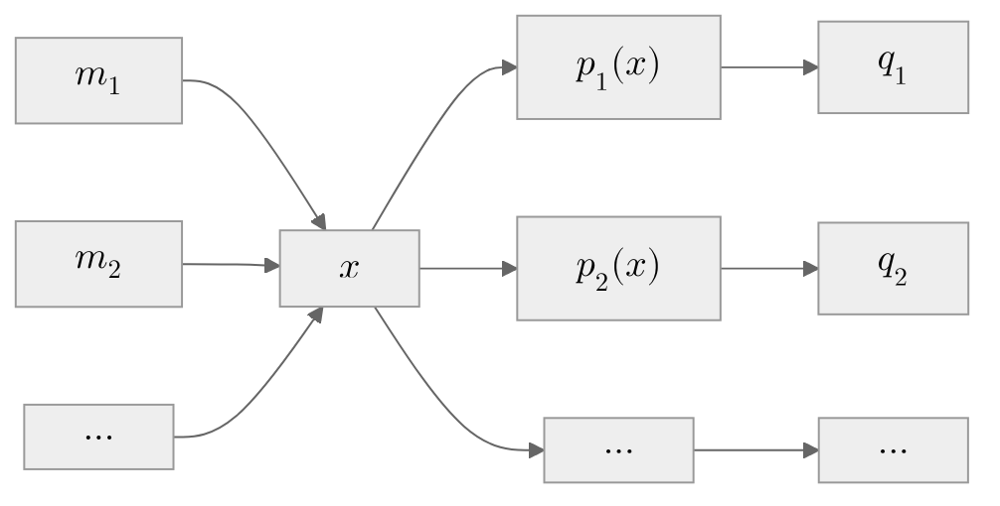

# n-sym.github.io
| Test | 1 |
| --- | -- |
| a | b |

```mermaid
%%{init: {'theme': 'neutral'}}%%
graph LR;
m1["$$m_1$$"]
m2["$$m_2$$"]
mi["$$...$$"]
x["$$x$$"]
p1["$$p_1(x)$$"]
p2["$$p_2(x)$$"]
pn["$$...$$"]
q1["$$q_1$$"]
q2["$$q_2$$"]
qn["$$...$$"]
m1 --> x
m2 --> x
mi --> x
x --> p1 & p2 & pn
p1 --> q1
p2 --> q2
pn --> qn
```