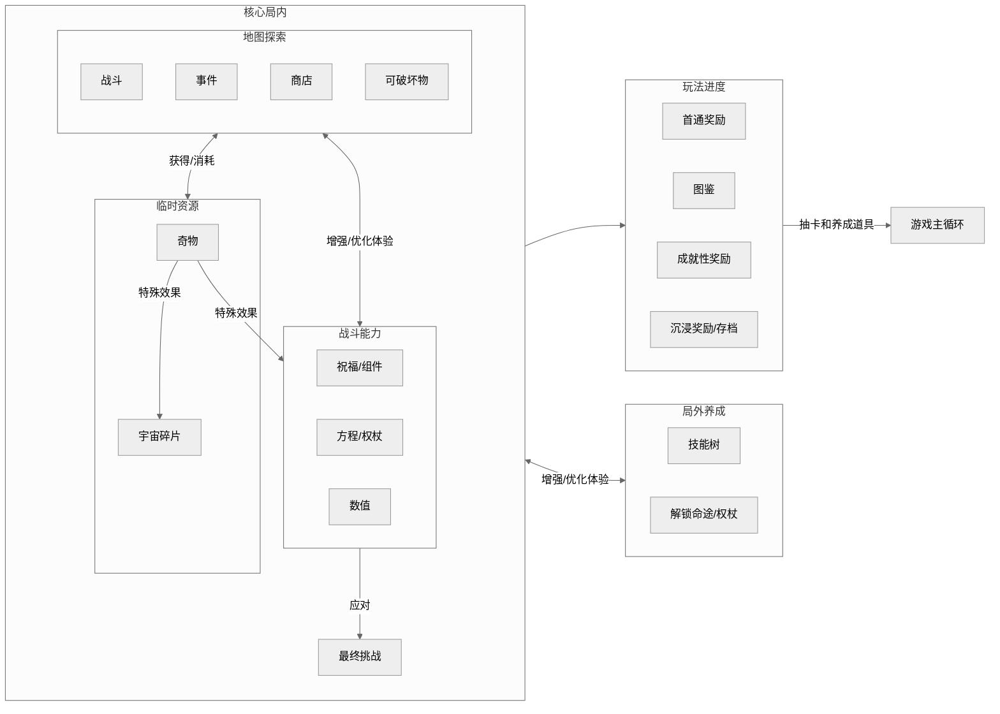
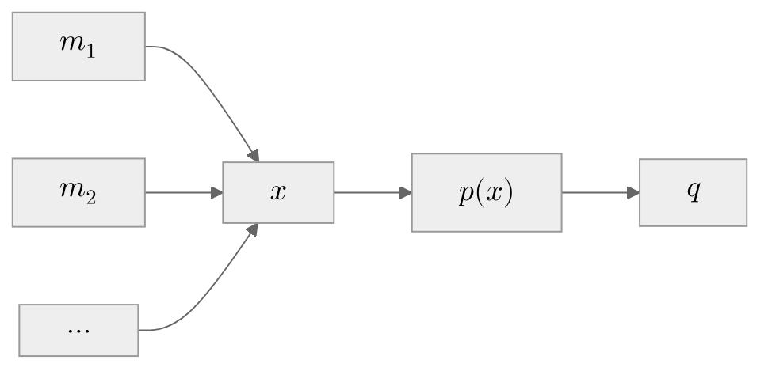
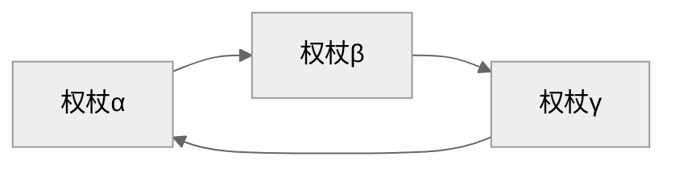
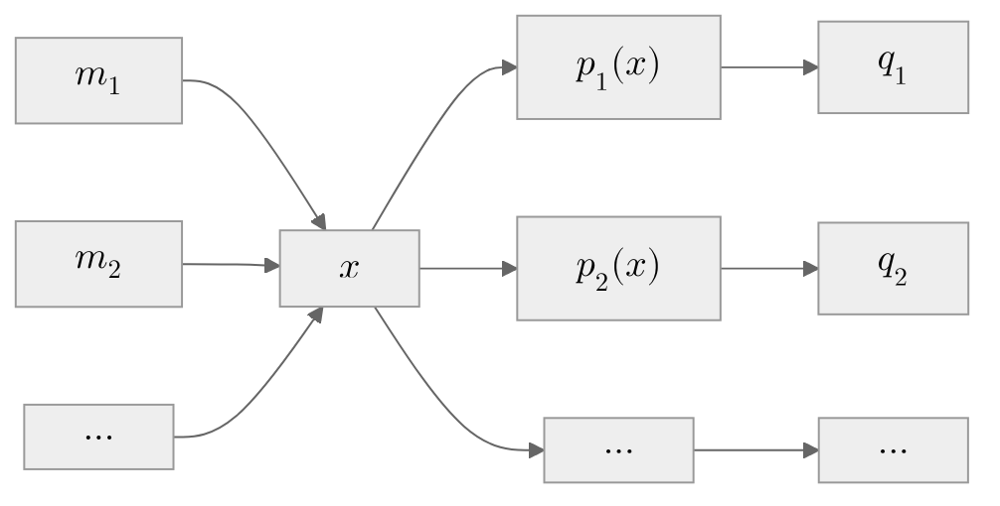

本文以米哈游游戏原神和崩坏：星穹铁道为例，讨论一系列PvE持续运营游戏中常见的Endgame玩法。

Endgame玩法是指游戏进度达到后期时，玩家可以从基础的养成、主线剧情中脱离，并接触的一系列全新的玩法。虽然本文主题所指定的两款游戏均是持续运营游戏，游戏内容会以固定的周期（42天）更新，但单次更新的内容可能不足以让玩家在整个周期内总有东西可玩，所以仍然会频繁地进入Endgame阶段。因此，不免需要讨论Endgame玩法。甚至可以说，对于持续运营游戏，Endgame玩法会非常重要。因为这样的游戏，本质上是在玩家的时间上和竞品零和博弈。假如内容被消耗得过快，Endgame玩法不够有吸引力，玩家转投别的游戏甚至养成了习惯，这是不利的。

本文分析的目标，原神和崩坏：星穹铁道，本身有相当的相似之处，但又存在着细微不同。通过对比分析两款游戏的异同，可以不错地了解目前头部的二次元&PvE持续运营游戏的玩法设计和运营现状。

在原神和崩坏：星穹铁道中，存在着几种类型的Endgame玩法，可以粗略将其分为：
- 养成验证（深境螺旋、幻想真境剧诗、忘却之庭、虚构叙事、末日幻影）
- 高难挑战（幽境危战、异相仲裁）
- 肉鸽（模拟宇宙：寰宇蝗灾等模拟宇宙DLC、差分宇宙星阶模式）
- UGC（尘歌壶、尚未正式推出的原神千星奇域）

它们的共性是：
- 几乎不影响游戏其余的模块
- 在游戏总体内容中占**绝对少数**
- 支撑了**相对多数**的社区讨论
- 通常需要玩家投入一定的成本，包括时间和金钱
- 受众为核心玩家

本文不会涉及具体到实现的战斗/养成机制和关卡设计，而是把它们当作一个黑箱。对于~~不存在的~~读者，本文假定读者已了解本文所讨论的两个游戏。
### 养成验证
#### 概览
养成验证，顾名思义，是原神和崩坏：星穹铁道推出的Endgame玩法中，以战斗为核心，考察角色练度和玩家操作的玩法。它的核心目标是给予玩家的养成正反馈，奖励丰厚的抽卡资源，玩家可通过“抽卡&养成->验证->抽卡&养成”的正反馈循环路径来持续获得正反馈。同时借此施加适当的压力，假如玩家懈怠了抽卡和养成，进行了类似“验证->验证->验证”的路径，也许就容易碰壁。这类玩法设计为让**多数**投入了**有效**成本的玩家通过，像是一种“合格性考试”而非“选拔性考试”，所以在难度上一般较为保守，但又不至于让大多数玩家都可以轻松通过。作为Endgame玩法，延长了游戏内容的消耗时间，也可以帮助维持日活。

这里当然也要给出一个关于验证的定义。笔者认为，这种验证是一种检验机制，玩家在增强实力后**主动**提交，进而可通过验证的反馈来调整自己的游玩策略。笔者始终认为，这个过程中，变化最有效的并非玩家账号的实力，而是玩家的自我认知。因为通过验证这件事根本上依赖的并非玩家的实力，而是通过的标准。通过验证后，玩家也许会获得“自己的游戏阶段上升一个层次”的自我认知，并且之后也会继续为维持这个认知而努力。这也就是验证玩法能提供一个正反馈循环的根本原因，它并不会因为单次的通过而中断，相反，每次的通过反而提醒着玩家要努力维持自己的自我认知。

除此之外，参与养成验证玩法是有游戏道具奖励的，更“实在”一点。通过养成验证玩法，玩家每年可获得的奖励是$$1600*12=120抽$$（按纠缠之缘或星轨专票计，此外还可以获得一些养成材料），而抽取一个限定五星角色的期望值约为91抽，也就是说玩家可以每年多获得接近1.31个限定五星角色。而玩家在42天的单个版本不用付费可以获得的总抽数，在“长草版本”下，对于原神大概是60抽，而星穹铁道是80抽。对于不付费就无法在所有单个版本内就攒出单个限定角色抽数的两个游戏，养成验证的奖励无疑是丰厚的。通过这样的奖励，玩家有更大机会抽到心仪的角色，也可借此提高队伍实力来应对日后的养成验证，对进入上文所说的正反馈循环是有益处的。
#### 启发式建立“判定机”模型
前文已经分析养成验证玩法从目标上为什么能Work，但还需清楚如何构建这样一个玩法。这里将从数据出发，所以需要简单的数学模型。作为PvE，也就是Player versus Environment的游戏，最关心的就是玩家自身实力和环境的难度的变化以及它们的大小关系。笔者在这里提出一个最简单的“数值检测模型”，想象关卡就是一个判定机，外表像是一个可以塞进卡牌的箱子，玩家递进去一张标有自己实际实力的卡牌，关卡就会吐出“通过”或“不通过”，具体依赖于关卡自身的环境难度。在这样的模型中，形式化的，考虑玩家理想实力的年化增长率$$r_{player}=(\frac{s_{ideal}(t_1)}{s_{ideal}(t_0)})^{\frac{12}{t1-t0}}$$和环境难度的年化增长率$$r_{env}=(\frac{s_{env}(t_1)}{s_{env}(t_0)})^{\frac{12}{t1-t0}}$$来代替。现在假设玩家的实际实力$$s_{actual}=k_{skill}s_{ideal}$$，其中$$k_{skill}$$是玩家的“技巧系数”。而玩家的相对实力$$s_{relative}=\frac{s_{actual}}{s_{env}}$$，也即玩家实际相对环境难度的比值。当$$s_{relative} \geq 1$$，关卡就会返回“通过”，否则返回“不通过”。

在最理想的情况下，$$k_{skill}=1$$，但实际往往并非如此。所以，实际的目标应该是尽量让$$s_{ideal}>s_{env}$$，才容易达成“通过”。而假如考虑一群玩家的$$s_{relative}<1$$，且他们已进入Endgame阶段，他们应该能通过一些**寻常**的努力（无需特别多的付费，或者投入很长的时间磨练技术，只通过日常养成与奖励和抽卡）改变这一点。因此，需要使得，才能实现在不提升平均$$k_{skill}$$的情况下玩家实力对于环境的追赶，有机会在某一时间“通过”，让每个人都能觉得自己“未来可期”，而非拼命奔跑却只能堪堪原地踏步。

---
##### 验证
为了为这样的论断添加可信的成分，不严谨地，这里直接使用笔者自己测试或者收集的数据，不怎么准确，这样得到的结论不可靠，也许是伯君一笑了。

对于星穹铁道，使用不精确的三目标木桩测试。选取相隔6个月的击破队和白厄队，读出击破队（2魂专光流萤，1魂阮梅，忘归人，6魂同协主角）的150行动值伤害约为400万，而白厄队（2魂专光白厄，1魂专光星期日，1魂知更鸟，专光布洛妮娅）的150行动值伤害约为1500万。计算得到的$$r_{player}=13.0625$$，而2025年1-2月混沌回忆-舸舰迷津的怪物总血量约为1082万，2025年6-8月混沌回忆-赤月吞狼的怪物总血量约为1585万，计算得到的$$r_{env}=1.1458$$。

对于原神，利用某小程序的DPS排行榜。选取相隔14个月的龙芙队和火茜希队得到龙芙队（1命那维莱特，1命芙宁娜，砂糖，菲谢尔）的DPS为114221，火神队（专武玛薇卡，茜特菈莉，希诺宁，班尼特）的DPS为248724。计算得到的$$r_{player}=0.9484$$。而4.2深境螺旋的怪物总血量为1072万，5.3深境螺旋的怪物总血量为1642万，$$r_{env}=0.4412$$。

---

原神和星穹铁道的数值设计目前都满足了$$r_{player}>r_{env}$$的条件，大抵意味着着笔者的推测确有一定道理。所以，对于正常投入有效成本的玩家，他的实力一定会有一天可以满足甚至超越环境的要求，通过养成验证玩法。这也就是这类玩法对于老玩家通常不难，但仍具有一部分乐趣，而对新玩家具有挑战性的原因。实际的战斗玩法并非基于笔者上面提出的小模型。可以想到，过分减小$$r_{player}$$使得角色的数值吸引力降低，影响付费结构，而过分增大$$r_{env}$$会引发玩家对于“水温上升”的不满，降低留存率，但确有在上述模型中不存在的因素可以帮忙解决这个矛盾：环境的定向鼓励与惩罚。

为了做到**定向**鼓励/惩罚，需要加强从前的模型，实力$$s_{actual}$$并非一个标量，它其实是多维度的向量$$\mathbf{s}_{actual}$$。因此，最初的式子会被扩展为$$\mathbf{s}_{actual}=\mathbf{K}_{env}\mathbf{K}_{skill}\mathbf{s}_{ideal}$$。基本上，其中$$\mathbf{K}_{env}$$，环境矩阵，作为简化的情形，是一个对角线矩阵，对角线上的值就是对于特定实力分量的鼓励/惩罚权重。$$\mathbf{K}_{skill}$$，操作矩阵，也是对角线矩阵，是对从前操作系数的扩展。

构成多个实力维度的是各个队伍的“特色”，也是玩家社区常说的“赛道”。队伍在玩法上做出区分，构成所谓“体系队”，例如原神的基于元素附着的冻结体系和绽放体系、与基于角色造成生命变动的烧血体系、基于角色是否能造成夜魂值变动的火神体系等，崩铁的基于追击次数的追击队、基于削韧量的击破队、基于快速生命变动的记忆队等。这些区分构建了$$\mathbf{s}_{actual}$$的多维度，能方便关卡设计验证伤害之外的指标。例如要求积累怪物的某种计量条，例如次数盾（虚界力护罩）、元素盾（深渊法师）、生命恢复（崩铁的死龙）来解除怪物免伤或自身DEBUFF，要求触发特定交互，例如需要爬到特殊柱子上（机兵）、需要将怪物从空中击落（龙兽）、需要场上有单位生成或死亡（赞达尔）等。除此之外，也可以用更加简单粗暴的方式，也就是“渊月祝福”、“地脉异常”、“记忆紊流”，本质上是更简单的BUFF或者一些独立于角色技能的伤害效果的触发器，一样要求伤害带有特定Tag或者特定行为。所有的这些提供定向鼓励和惩罚的，就构成了模型中的$$\mathbf{K}_{env}$$。

至此，玩家的路径依赖问题已被相当程度上化解或转移：玩家已经不容易“一招鲜吃遍天”了，除非他们付出更多的成本。尽管大多时候玩家都选择后面的路径，也就是用更强的、具有很多冗余的队伍来撑过机制不那么契合的关卡，但这实际上变相优化了“无法验证溢出强度”的问题，因为溢出的那部分实力现在有用了。所以巧妙地，无论如何，玩家要么直接配合，要么间接配合。
#### 具体分析
在上文，本文简单从宏观上对寻常所说的深渊，即“深境螺旋”和“忘却之庭”，启发式地建立了模型，大概可以基于这个模型来搭建类似的玩法。实际上这两个玩法和本文的模型仍有巨大的不同，最显著的区别就是深境螺旋和忘却之庭的最高难度，也就是12层，会要求玩家构建两个队伍，应对上下两个环境不同的关卡。并且，拥有计时器，一般要求在指定时间（3分钟，10个轮次）内击败所有敌人。所以文章所讨论的$$s_{env}$$应该是环境要求的每秒伤害/每轮伤害。当然，上面的数据例证仍然是有效的，因为这里计算的是比值的幂。

正因为具有合适的难度，能够参与的玩家不在少数，深渊玩法一度成为社区讨论度最高的Endgame战斗玩法，玩家通常围绕此来展开队伍的构建，以及调整自己的抽卡与养成策略。但事实证明这一类玩法并非银弹，仍存在着许多问题：
1. 玩法本身的社区认可度降低。因为通过率持续提升，不是高手的玩家也可轻松通过
2. 对于中氪以上的玩家，难度过低，只能通过竞速或者压低自己的配置来获得挑战感
3. 玩家路径依赖，习惯于用固定的队伍来解决不同的关卡，对新卡兴趣降低
4. 新卡的溢出强度无法被环境有效验证，影响新卡的推销

对于这些问题，原神和星铁都探索了各种解决方案，分别推出了其它的玩法与原有的深渊轮替。

幻想真境剧诗是一个与深境螺旋截然不同的全新玩法，不再要求组建上下两队，而是给角色限定出场次数，同时要求玩家培养足够的角色，只允许指定元素的角色和4个特邀角色入场，攻克多个难度不同且各有倾向的关卡，强调元素反应作为触发条件、BUFF的选取以及角色配队的规划，体验上比起传统深渊更像是肉鸽。玩家不像在深境螺旋里那样可以随意选择队伍，而是受限于局内随机的抽取和玩法最开始准入的规则。这个模式尝试打破玩家在深境螺旋环境下长期养成的“体系队”路径依赖，鼓励玩家灵活地思考应对方式。遗憾的是，因为和旧有的玩法有一定差异，玩家难以无痛转换思路，并且玩法本身随机性略强，最终导致反响并不那么好。但它仍达到了它的目的，优化了部分深境螺旋最初具有的和几年来环境更迭带来的问题，起到了互补作用。

虚构叙事则只是忘却之庭的变种。这里按照改良过的版本讨论。主要做出了几点变化。虚构叙事的波次刷新不再重置行动值，对队伍的启动速度有所要求。在忘却之庭中，只要在第一波次的第零轮的150行动值内完成第一波次，就可以在第二波次重新获得完整的150行动值。而在虚构叙事里，所有波次共享恒定的行动值。如果在启动（进入某种强化状态）前清杂能力弱，队伍表现就会大打折扣。同时，常驻多个怪物，鼓励群攻。在最新的虚构叙事里，击杀小怪可以扣除精英怪的血量，而精英怪本身具有相当高额的血量，鼓励玩家在攻击精英怪的同时多清理小怪，这样能有效降低难度。虚构叙事的环境天气相对明显，BUFF专一。忘却之庭也具有记忆紊流，但所提供的BUFF很多时候比较泛用，作用也不那么明显。而虚构叙事的天气效果和BUFF极其关键，几乎决定整个体验。

末日幻影同样是忘却之庭的变种，但侧重点和忘却之庭以及虚构叙事又不一样，最显著的区别是具有一个精确的行动值量表。末日幻影和虚构叙事一样具有强力的天气和Buff，并且对于非弱点的属性额外提升了抗性，只有单波次，但一般需要进行两个阶段的攻坚。每一阶段由“削韧-爆发”组成，玩家需要利用角色技能或通过机制先削减首领敌人的韧性，在破韧之后可立即获得显著的奖励，这是一个确定的主题，但却由不确定的方式来实现（表面上鼓励快速削韧，但并非硬性需求，常见有额外的机制帮助削韧，甚至只能通过机制来进行削韧），实际上比较深刻地影响了玩家社区对于角色强度指标的定义。

即使有了这么多改进的玩法，一些问题依然会存在，且难以忽视，所以需要引入设计上更先进的战斗玩法。
### 高难挑战
#### 图穷匕见
没错，“更先进的战斗玩法”就是所谓的“高难挑战”。高难挑战本质上仍是一种养成验证，只是比寻常的养成验证难得多，要求的不只有天赋等级和圣遗物/遗器，还有队伍的抽卡成本。它的核心目标是在游戏内给予玩家进一步的投入进一步的反馈，而非只能在游戏外炫耀。与之对应的，不会提供抽卡资源的奖励，不再与原有深渊轮替，更新速度更慢，并非半个月/两周，而是一个版本的42天。所以笔者将其单独列出。
#### 概览
高难挑战玩法可以说是脱胎于原本深渊的竞速玩法，第一次把竞速指标放在关卡目标内。所谓的竞速指标并非原本深渊的3分钟计时器/10轮次计时器。原本的通过标准，笔者认为是一种合格性**时限**（甚至称之为Deadline），不满足会扣除基础奖励。而竞速指标是指已经进入时限内时，进一步缩减通关用时，可获得额外奖励的标准。而这些额外奖励通常是不提供养成价值的，只是限时的外观奖励。体现在幽境危战，是通关最高难度可获得武器幻化，**时间短于180s**可以获得进一步升级的武器幻化，而体现在异相仲裁，是**0轮次**通过王骑关卡或通过未削弱的王骑关卡可获得钻石头像框。可以见到与养成验证玩法显著的区别。

前文说过，过分增大$$r_{env}$$可能会导致留存率降低，这是养成验证玩法在原有的关卡上做手脚时会发生的。而如果加入了新的关卡，且这个关卡不奖励抽卡资源，那么**多数玩家**对此关卡的变化可能并不敏感，于是我们可以极大的增加“最难关卡”范畴上的$$r_{env}$$。这样，如果统计每个版本最难关卡的$$s_{env}$$，对于这个抽象出来的“最难关卡”环境来说，就获得了极大的$$s_{env}$$（比如关卡的血量从原本的2000万增长到超过一亿），而不产生什么震荡。从结果来看，除了一部分玩家的认知失调，玩家社区是欣欣向荣的。当然，$$r_{player}>r_{env}$$的假设在接下来应该仍会生效，尽管目前没有足够的数据。不过可以保证，如今的$$r_{player}$$与之前的统计范围是不同的，相比从前锚定多数玩家的范围缩小了非常多，代表了更多的在游戏内的投入，而这些玩家的实力增强也相对高，由此在$$s_{env}$$剧烈增长后，$$r_{env}$$也只会更大。

实际上，原本的养成验证玩法并不是非常P2W，大多数玩家都会相信，不需要付费也可以攻克最难的关卡，依靠一些努力。而相比之下高难挑战的P2W色彩非常浓重，~~几乎~~不存在完全不付费就能获胜的长期玩家，免费玩家和付费玩家在这个玩法内泾渭分明。当然，这里说的付费玩家也是需进一步细分的。最能得到优势的会是**维持持续付费**的玩家而非曾有高额付费的玩家。也就是说，高难挑战玩法不仅对付费总量有要求，还对付费习惯有所要求。

现在，把应用于养成验证玩法的模型套用过来，可以将高难挑战视为一种养成验证的变体来分析。从具体的战斗玩法上，有以下改变：
- 要求至少三个队伍，多于深渊的两个，变相提高抽卡压力
- 怪物或者关卡本身会有独特的机制，定向筛选的强度更高，对当期UP角色的宣传作用提高
- 除了进攻侧的数值考验，还会提高玩家的防守端压力，对玩家的操作也更有要求，免于显得像粗暴的DPS/DPR检测器

我们基本勾勒了高难挑战玩法的框架。但需要知道的是，设计这样一个玩法的收益实际上可以更大，通过把关卡削弱成一些入场成本更低的版本。前文把高难挑战玩法锚定为部分付费玩家的专属玩法，但真实情况并非如此。假如只有付费玩家能上手体验一下，那么对日活的贡献与对付费结构的改变有限，因为有可能投入更多时间或提升付费层级的玩家无法通过从前深渊的“验证”路径来获得动力进入新的循环。想象一下，游戏里摆着一个无法战胜的关卡，处于过渡态的玩家的提升在到达阈值之前无法得到认可，无疑这是一种挫败。所以，高难挑战玩法仍然需要有多个难度，像原来的养成检验一样，并且正式的高难挑战玩法的最简单关卡与没有高难挑战玩法时的最难关卡难度相当。这样一来，就能足够细分，让投入层次不同的玩家都能通过一个与从前相似的验证关卡来验证自己的抽卡&养成，得到获得感，不仅能影响付费率，还能影响付费结构。
#### 具体机制
幽境危战总共设计了6个难度的关卡，7个目标，前6个目标分别是通过对应的关卡，而最后的目标是把通关最难关卡的时间之和压缩到最多180s，在这里用n1到n7代指7个目标。n1-n7全部有三个关卡，每个关卡有时限。其中n1-n3是面向多数玩家的，其中的怪物和大世界是一样的，但是等级可能会更低，时限为10分钟，关卡间可复用角色，非常好通过，提供替代原本420原石小活动的450原石。在定期的“紊乱爆发”期，玩家挑战幽境危战可获得额外的圣遗物奖励，而n3所对应的关卡是供玩家速刷用的。n4-n7的怪物和大世界不同，往往获得一些加强，可以更好地进行上文所说的定向检验，时限为120s，关卡间不可复用角色。其中n5及以上无法通过多人挑战获得奖励，专攻高难挑战的实现，n4则仍作为一个提高社交性的手段存在。n4和n5奖励高级养成素材，n6和n7奖励外观上的武器幻化。其中n7的设计较为独特，不是在n6基础上增加血量或者缩减时限，而是把社区的竞速玩法正式实装到游戏中，要求三个关卡通过时间之和，这意味着玩家可以选择“一超二强”的策略，可以更多投入给环境适应性强的队伍，也可以让三个队伍的实力接近，最优化最差情况。无论如何，对玩家的抽卡规划以及~~付费~~投入程度都有较高的要求。

异相仲裁需要玩家满星通过其它三个逐光捡金玩法才能解锁，因而没有相当于危战n1-n2的难度，包含三个骑士关卡和一个王骑关卡，挑战骑士关卡后可以降低王骑关卡的难度，也可以直接挑战王棋关卡，在通过后骑士关卡也会算作满星通过，骑士关卡间不能复用角色但不影响王骑，每个关卡都具有不小的定向检验性。未降低难度的王骑关卡相当于n7，而0轮次通过降低难度的王骑相当于n6，都会奖励钻石头像框。异相仲裁的关卡在超过满星时限后每一轮次都会给玩家相当强的buff，超时的王骑关卡和时限内不能达成0轮次的王骑关卡实质上分别作为n4和n5，奖励高级兑换道具和高级养成道具，还有也许不怎么有人会炫耀的金银铜头像框。骑士关卡在不超时的情况下相当于n4，超时则最终会趋于n3，奖励高级兑换道具。异相与危战的设计不同，可以选择“一超”的策略，因为只要有一个队伍力大飞砖就可以无视骑士关卡，但实际上这样做的成本非常高。如果打算用三个实力相近的队伍来通过，对于这四个难度不均的关卡来说并非最优解，容易在王骑关卡吃亏，除非每个队伍都有不小投入。即使能做到“一超二强”，因为定向筛选的强度高，最终也会趋于提高平均实力~~当然也可以放弃这个玩法~~。无论如何，与危战一样，对玩家的抽卡规划以及~~付费~~投入程度都有较高的要求。

这两个玩法是完美的吗？也许不是。目前还没有足够的数据和讨论来就此进行分析，给出客观的结论。但它们大概足够好。原神和星铁都有相当矛盾的行为：一方面对一些玩家绥靖，在主线和大多数活动里实行弱保软，另一方面对一些玩家push，明摆着暗示“要维持付费习惯才能保证游戏里的等级”。对于这两者之间的玩家，则有可能产生认知失调，这就逼迫他选择一条路径，体现在可能的付费结构的优化，因为这类玩家原本通常也会付费，但存在**量**的差别让他无法成为第二种玩家。这时候，笔者要再提一次最初的看法：验证玩法能生效，是因为玩家有动力驱使他们维持自己的自我认知。但对于自我认知为空的第一种玩家，一切的养成验证玩法都不能起效，更何况加强为高难挑战。因此，笔者认为这两个玩法并不完美，它们只是完成了它们服务于一小部分~~存量~~玩家的目的，尽管这一部分就贡献了不少游戏内的收入，但总体来说对于扩大这一部分核心群体的规模、打造整个游戏的IP、吸引圈外的玩家兴趣都是没什么特别大的帮助的。话虽如此，对于Endgame本身，显然是相当足够的，从玩家的在线时长上也许就可以看出端倪，不然星铁也不会在原神推出危战后迅速跟进。
### 肉鸽
##### 概览
来到这里，讨论的主题不再尖锐了，可以不那么关心“日活”“付费结构”之类的东西，而关注游戏性，进行像样的拆解了。
在这里，主要讨论包含差分宇宙在内各类模拟宇宙。相比原神在大世界百般雕琢，星铁更愿意用一个成本没那么高的精品玩法来延长玩家的游戏时间。与以上的对抽卡&养成进行强烈要求的各类验证玩法不同，在模拟宇宙尤其是之后推出的黄金与机械、差分宇宙、不可知域里，角色自身的数值其实没那么重要，更多是以角色作为祝福/方程/权杖效果的触发器，关键点在于局内的Build。

所有模拟宇宙基本都遵循同样的模式：

##### 理念
**特定行为或机制作为触发器**是星穹铁道的传统艺能（当然也是原神以及非常多游戏的）。拗口的粗体字实际就在描述这样一个过程：有动作$$m$$（或者$$m_i$$，假如有多个），资源$$x$$，条件$$p(x)$$和结果$$q$$，通过$$m$$积累$$x$$，从而达成关于$$x$$的$$p(x)$$，最终获得$$q$$。给出两个实例：
- 遐蝶：我方单位造成生命值变动（$$m$$），积累新蕊（$$x$$），新蕊达到上限（$$p(x)$$），释放终结技（$$q$$）
- 权杖进化改-极端：我方目标释放终结技（$$m$$），恢复50点充能（$$x$$），充能达到120点（$$p(x)$$），发动攻击（$$q$$）

很容易发现，这两个例子有类似的结构，我们认为它们是同构的~~虽然这里没有群~~，因此只需要研究其中一种就可以了。针对模拟宇宙/差分宇宙，命途回响、方程、权杖，似乎都有着同构的那一面。笔者称这里的为**I型**，其特色就在于，资源$$x$$仅有条件$$p(x)$$可以利用或消耗，这维持了一种机制间的正交性，降低了耦合，方便设计模拟宇宙中可能数以百计的效果。

仅仅只是这样，就能产生一些build了。在笔者认为设计最激进的不可知域里，玩家可以拥有三台权杖。这是有意设计的数字，权杖只能通过唯一的决策组件直接与其它权杖互动（回复能量、减小行动值、立即行动）。忽略外界相关的输入，只考虑权杖内部的关系，实际上形成一个有向图。当这个有向图联通，也许就存在左脚踩右脚上天的玩法了。

实际的例子：
- α：嵌合在【充能】类权杖时，攻击后使1台其他随机【充能】类权杖恢复等同于50%最大充能的能量，并使其下次攻击增幅提高40%，攻击后清除。
- β：嵌合在【充能】类权杖时，使其每攻击1次后，1台随机【速度】类权杖立即攻击。
- γ：嵌合在【速度】类权杖时，攻击后使所有【充能】类权杖恢复等同于40%最大充能的能量。

在这个例子里，整个系统是有能量耗损的。β能把它的能量以100%的效率传递给γ，γ只能以40%的效率分别把能量传递给α和β，而α仅会以50%的效率把能量传递给β。假如没有持续的外部输入，是不能实现永动机的。权杖不能只靠决策组件永动，但权杖嵌入的其它组件可间接触发权杖本身或其它权杖的效果，带来内部触发的外部输入。笔者并没有详细计算过，也许能build出卡死战斗的永动机已经被数值上的设计避免了，但至少让权杖连续攻击很久（也许十几分钟）是容易的。

而对于使用祝福、方程的传统模拟宇宙，一个命途往往有共享的资源，可以用于多种用途，也就是具有多个条件$$p_i(x)$$来利用资源。例如毁灭命途的耀变。这种情形，笔者称之为**II型**。

组合I型和II型，就几乎拥有了整个模拟宇宙——的战斗玩法。
模拟宇宙里有关资源积累的除了战斗区域，还有事件区域。以模块化的方式拼凑事件的话，可以简单把模块分为：
- 引发战斗
- 获得/失去祝福/组件/方程/权杖
- 回复/扣除角色生命值
- 增加/消耗宇宙碎片
- 获得/失去奇物
- 随机数判定
- 临时内部状态（事件内部的多级选择）
- 持久内部状态（用于系列性的事件，选择会影响后续）

在有了战斗和事件后，就需要把各个模拟宇宙小房间串联起来了。所有模拟宇宙房间串在一起都是度最多为3的有向图，玩家总是从根出发。其中，在寰宇蝗灾和黄金与机械，玩家可以看到整个模拟宇宙的2D地图，每个房间体现为六边形，移动到新的六边形后会让不可达的房间塌陷。而在其它模拟宇宙里，没有地图，因此也无法反推实际的整个情况，从“如无必要，勿增实体”的角度，或许可以认为是在三叉树上行走。
#### 机制与体验
前面已经基于一些实例，简析了模拟宇宙的核心设计。为了让模拟宇宙更具有可玩性，仍然需要加入一些其它机制。
##### 复活装置
在模拟宇宙里倒下的角色可以花费宇宙碎片来复活，增加容错。
##### 映射
新的模拟宇宙中，玩家没有养成的角色也可以自动映射到合适的养成程度。
##### 编队功能
旧的模拟宇宙中最开始可以下载四个角色，在之后通过宇宙碎片继续下载角色。而新的模拟宇宙中去除了这个限制，可以随意使用编队功能。配合上面的映射功能，实际上鼓励玩家依照局内形式选择Build。
##### 消耗品
通过一些技能树效果，可以在模拟宇宙里吃药了。优化了最明显的痛点：玩家在模拟宇宙使用黄泉的秘技斩杀怪物时战技点不足。
#### 总结
模拟宇宙被设计为复杂程度适中，不喜欢build的玩家可以快速通过一些关卡获得想要的奖励，而喜欢build的玩家也有东西可以钻研。但按照惯例，这里给出模拟宇宙的缺点。模拟宇宙的随机性强，一局时长比较久，玩家往往会有很高的试错成本，因而需要在事件的选择给出更多的提示，例如对每个选项的结果利用选项的颜色来暗示，同时降低试错成本，例如允许从上个精英怪结束处读档，这样来引导玩家选择更“有趣”的选项。
### UGC
鉴于撰写本文时还无法体验千星奇遇，能沾上UGC的就只有尘歌壶了。但尘歌壶的UGC那部分很重要吗？这个玩法并没有设置足够的奖励吸引玩家，也没有付费点，我一直认为是一个补充性的玩法。其中能体验类UGC玩法的方式就是通过进入他人的尘歌壶、摹本，通过一些可能是不可编程的小机关来实现简单的关卡搭建。

那么，在千星奇遇还未实装之际，笔者或许可以展望一下它的定位和价值。首先，千星奇遇里有付费点，这是决定性的，说明它是也许是一个在将来会被重视的模式，因为它可以贡献收入。

### 后记
这不是一篇专业性比较强的文章。
显而易见，因为我缺乏很多关键的调查和数据以及计算，很多分析仅仅是基于主观出发，可以说，是一个感性带动理性，先作为玩家体验而后尝试从设计角度反推的过程。在游戏途中不免会有思考，所以，笔者把这些思考记录了下来。其中不乏偏见与臆测。

但愿在数年后，再想起时，会怀念能洋洋洒洒写下上万字的时光。

本文作于2025年10月。
