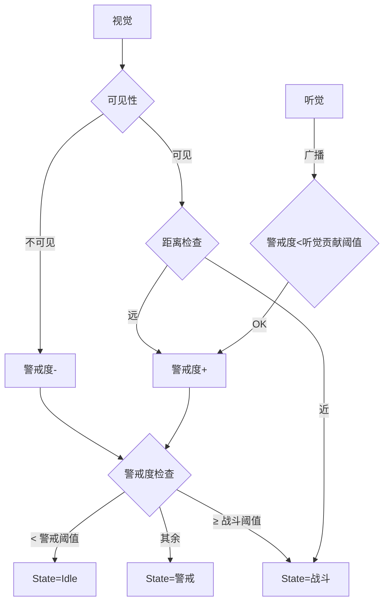
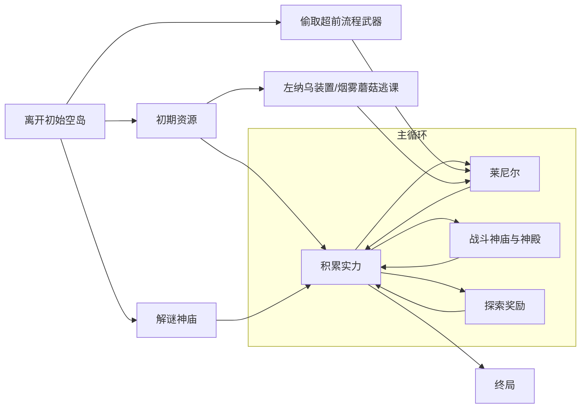

本文假定读者已了解前作《塞尔达传说：旷野之息》，并对王国之泪也有一定了解。因为机制互相耦合，所以不能确保每个名词被解释后才被提到~~为什么不拓扑排序~~。
## 引入
旷野之息可以说是笔者所游玩过的游戏中独一份的白月光。2023年，饱含期待地，玩家迎来了它的续作王国之泪，如今也已是两年前了。在时间的检验下，关于王国之泪这款游戏究竟如何，大家都有了结论。堪称是站在巨人肩上，王国之泪突破了前作的高度吗？

对于笔者而言，答案也许是：**没有**。

请不要误会，这里并不是说王国之泪不如旷野之息。笔者认为王国之泪是非常好的游戏，很多时候比前作更加好玩。但实际上，即便这么说很难让人不觉得是白月光的滤镜，旷野之息确实在同期是一个更加值得学习的对象。也许这里显得很偷换概念，不值得学习并不代表做得不好，也可以解释为复现难度高，不能和游戏“更好”或“更不好”划等号。对于笔者而言，刚拿到游戏，畅快地一天玩上十小时的时候，是相当快乐的。但热情消散后，回想起自己的体验，很多时候，我都会想说“这不是和从前一样吗”，又有很多时候甚至还不如从前。本作确有一些地方不尽如人意，而这就使得它没有达到我的提升预期。于是，我并不认为它能相比前作来到新的高度。空口无凭，为了得出这个结论，本文将详细拆解分析**王国之泪的改进与遗憾。**
## 概览
### 乘法交互
#### ECS
### 
施工中
## 道具
### 基础
林克的道具格有限。弓箭、盾、武器格子是可以扩充的。
如果不加说明，林克可以把道具从道具格里取出来，扔到开放世界里去。
#### 防具
从NPC购买或开宝箱获得。提供防御力，装备时应用性质，当装备一套套装还可以获得套装效果。不能从背包里取出，但可以卖掉。
#### 弓箭
从怪物手上、地形布景处拾取，NPC锻造、购买或开宝箱获得。提供战斗的远程攻击，需要同时具有弓和箭矢。弓拥有耐久度，射箭需要消耗箭矢。在王国之泪里，箭矢只有木箭。
#### 盾
从怪物手上、地形布景处拾取，NPC锻造、购买或开宝箱获得。提供战斗中的防御，自身具有防御力，承受攻击将损失耐久度。此外，还可以踩盾滑行，也需消耗耐久。
#### 武器
从怪物手上、地形布景处拾取，NPC锻造、购买或开宝箱获得。提供战斗中的近战攻击，自身具有攻击力，拥有耐久度。
#### 材料
从怪物身上、龙身上、地形布景或开宝箱获得。用于兑换、烹饪或者余料建造。可以手持。有些可以食用。具有余料建造攻击力。
#### 料理
烹饪、NPC奖励或购买获得。可以食用。
#### 左纳乌装置
从扭蛋机处或开宝箱获得。无法拾取地图上不是胶囊的左纳乌装置。
#### 重要道具
从各种任务处获得。不能从背包里取出，也不能卖掉。
### 词条
弓箭、盾、武器、防具还有料理可以拥有词条。除了防具和料理，随道具本身出现的词条由一套隐藏分机制控制，随机出现。下面给出**随机词条**的表格。

| 词条       | 应用道具种类  | 稀有度  | 效果              |
| -------- | ------- | ---- | --------------- |
| 攻击力提升（大） | 武器，弓箭   | 蓝（金） | 增加攻击力3-5（6-10）  |
| 盾防护提升（大） | 盾       | 蓝（金） | 增加盾防御力3-5（6-10） |
| 耐用度提升（大） | 武器，弓箭，盾 | 蓝（金） | 增加耐久度3-5（6-10）  |
| 速射       | 弓箭      | 金    | 蓄力时间减少          |
| 5连发      | 弓箭      | 金    | 一次射出五支箭         |
| 远距离投掷    | 武器      | 金    | 投掷距离变远          |
| 结束暴击     | 武器      | 白    | 攻击循环的最后一击暴击     |

有关防具和料理的词条固定出现，可称之为**增益词条**。当这些效果由料理提供时，会有持续时间的限制。这些增益词条不能无限制地叠加，往往有1级到3级的上限。因为种类很多，这里取一些有代表性的。

| 词条      | 来源              | 效果             |
| ------- | --------------- | -------------- |
| 能源持久    | 左纳尼乌姆套装的任意一件    | 电量消耗减少+1级      |
| 俯冲机动力提升 | 滑翔套装的任意一件       | 俯冲时水平移动速度提升+1级 |
| 火焰防护    | 防火套装的任意一件/火神兽兵装 | 特高温的抵抗+1级      |
| 攻击力提升   | 许多许多            | 攻击力提升乘区增益+1级   |
| ……      | ……              | ……             |

### 特性
弓、武器、防具以及材料都有特性。其中，用高亮文字清晰指出的是战斗特性，而用白色描述暗示或者没有提及的特性是隐藏特性。不过，即使是战斗特性，也是可以不体现在道具描述文案里的，这里依照按下左键切换武器界面的蓝色字体描述。
列出一些战斗特性的典型：

| 特性         | 来源     | 效果                                |
| ---------- | ------ | --------------------------------- |
| 在即将损坏时威力提升 | 近卫系列武器 | 耐久小于等于3时，武器面板*2                   |
| 突击攻击威力提升   | 王族系列武器 | 林克时间突击时，武器特性的乘区设为2                |
| 击败瘴气的驱魔之剑  | 大师之剑   | 面对加侬时基础攻击力变为60，攻击不消耗耐久，可以打回加侬的投射物 |
| ……         | ……     | ……                                |

隐藏特性非常容易被发现，在余料建造时，也非常有用。这里也列举一些：

| 隐藏特性          | 来源     |
| ------------- | ------ |
| 遭受冲击时爆炸并范围性放电 | 黄玉     |
| 让箭矢追踪敌人       | 各类眼珠   |
| 攻击时恢复血量       | 多种白龙材料 |
| ……            | ……     |

### 余料建造
余料建造是这样的系统：给定基座（武器和盾），可以将大多没有自己的AI（看起来不像活着的动物）的游戏对象附加到基座上，得到的新道具拥有基座的战斗特性而拥有余料的隐藏特性，能保留基座的随机词条，攻击力是基座攻击力和余料攻击力之和。

基于组合，游戏中的道具被极大地丰富了。下面给出一些有趣的例子。

---
##### 石头锤子
余料建造任意武器+石头就可以让武器拥有石头的钝器属性了，对矿脉的破坏力会增强。
##### 冷气果剑
余料建造单手剑+冷气果。挥砍命中时，冷气果爆炸，造成冰属性的效果。
##### 黄玉剑
余料建造单手剑+黄玉。挥砍时，施放一个漂浮的电球投射物。

---

也许很容易注意到，黄玉和冷气果在这里的行为没有保持一致。挥砍命中时它们理应都会遭受冲击而爆炸，但黄玉剑却表现得像一个法杖。笔者称之为**余料特化**。对于一些特定的组合，并不按照最初的规则来结合基座和余料的特性，而是产生了其它模组。这也是提高道具丰富度的手段，给相似余料做出差异化，避免多种余料显得像是复制粘贴。

余料建造也可以提升道具的耐久。基座道具有一个耐久上限，而全新的道具的耐久度并未达到这个上限，需要附加余料才行。这是符合直觉的设计，当我附加新的组件上去，原来的道具被加固，变得更结实了。

最后，余料建造道具可以被拆解，只需在一始村花费20卢比，这就带来了很低的试错成本。往往会有玩家尝试把武器拼到武器上，这样有可能使得珍贵的武器变成余料而变相失去它（因为它已无法在最终的道具体现自己的战斗特性），而现在只需小小的代价就能将珍贵的武器分接下来。低试错成本鼓励玩家多尝试不同的组合，不囿于固定的几种搭配。

此外，射箭时可以选择林克携带的材料，让箭矢附加上余料的攻击力和隐藏特性，是一种比较受限的余料建造，替代了前作的属性箭矢。
### 总结
在前作的基础上，通过组合式的设计，王国之泪中产生了极丰富的道具。又借助余料特化，提供了一些令人眼前一亮的小设计。

然而，有这么多花哨的选择摆在玩家眼前，其实是有利有弊的。玩家虽然能获得很强的游戏性，也得到了便利，但部分道具仍然无法物尽其用。同时，探索过程的心流体验其实是受损的。

过多的选择使人迷糊，作为一个极端情况，很多时候不方便玩家迅速地找出合适的搭配，而是随机选择余料。而另一个极端情况，就是由于设计并不太平衡，愿意思考最佳搭配的玩家在找出最优解后，其余的余料也就多数成为了废品，被最好的同类余料替代。尽管任天堂已经想到这一点，设计让所有的材料都可以当作箭矢的余料被打出去，但这并没有改变废品处境的事实，这些道具最大化价值的方式就是兑换成卢比，或是被和箭一起射出去。除了余料之间互相替代外，余料也替代了武器。王国之泪里只有少数武器拥有钝器的隐藏特性，但是如果使用余料建造，每个武器都能变成钝器，类似上面的例子“石头锤子”。这在事实上导致，本来有价值的道具因余料建造而变得没用。而从直觉上，余料建造应该只会使得所有道具都变得更有用才对。

在旷野之息，选择少了许多，也就导致了多数玩家都能选择最好的武器（兽神大剑，守护者之斧++），使得玩家容易定期取刷取特定武器，而许多道具的作用几乎为0。任天堂的设计目标也许就是让一系列道具的获取驱动探索，探索与此同时回馈足够多（但不一定好）的道具，玩家只需要在路上一边捡道具一边战斗，探索和战斗就能借助道具串连在一起，拥有适宜的节奏，整个探索的心流不会被道具刷取的问题破坏。对这个目标，如果仅关注这一个系统，王国之泪做得远好于旷野之息。也就是说，假如把余料建造移植到旷野之息，会有不小的体验提升。但王国之泪在其它方面也有改动，导致了一些有趣的变化。因为王国之泪的设计侧重点不同，也许玩家的心流体验已经不集中于探索了。在探索心流的占比不高的情况下，对它的保护自然也就显得没那么有意义。在实际的王国之泪游戏中，余料建造加持的道具系统更倾向于作为一个加快游戏节奏的角色。

也许以上理由都十分牵强。因为游戏面向的玩家是多种多样的，王国之泪的道具系统能服务于多种玩家，而给不同的玩家带来的体验都能比较优化，这没有问题。不过笔者还收集到一个有趣的看法。对于游戏整体的美术风格上，带余料建造的道具系统是破坏性的。林克会背着拿着各种各样古怪的东西。想象林克背着弹簧盾的样子，简直太奇怪了。这种不协调的元素组合导致沉浸感被破坏，间接削弱了探索的心流体验。而这种心流体验正是前作旷野之息的突出点。
## 战斗
### 基础
#### 生命值
与多数游戏的生命值一样。林克的每颗心是4点生命值，初始拥有3颗心，最多拥有40颗心。但考虑到优先分配给精力，实际上一般是38颗。

额外的，林克有一个满血保护，避免在前期被怪物轻松一击秒杀。
#### 受击
林克受到攻击会扣除生命值。计算时，会减去防具的防御力，并且每次最少扣除1点。
#### 攻击
装备近战武器时，按Y挥砍。仅当装备单手剑时，林克的左手不被占用。
攻击会消耗耐久。与旷野之息不同，如果这次攻击只是用于激活装置，不会消耗耐久。
长按Y会消耗精力进行蓄力攻击。
特别地，在空中攻击会替换成下劈，落地后可造成额外的范围伤害。
#### 拉弓
装备弓后，按ZR拉弓，在蓄力一段时间后松开ZR来射箭。
拉弓需要双手，手持弓时林克的左手也被占用。
特别地，在空中拉弓会获得林克时间。
#### 投掷
按ZL投掷。对于有投射物的武器，不会投掷武器本体而是发射投射物。也可以按上键，改为投掷材料。
#### 举盾
按住ZL注视。若装备盾牌，且林克的左手空闲，就可以举盾。举盾可以阻挡攻击，但会损失伤害减去盾防御力的盾牌耐久。同时，承受冲击力强的攻击林克也会进入硬直，无法挡住接下来的攻击。
#### 盾反
举盾后，按A就可以进行盾反的动作。盾反可以弹回部分投射物，弹回的投射物可以伤害怪物，若盾反对象通过近战攻击，则往往还可以造成比较大的硬直，甚至将敌人的武器击落。

盾反需要配合敌人进攻的时机，输入提前或滞后都会失败。输入提前，会得到比较强的惩罚，林克将受击。输入滞后，相当于只举盾不盾反，浪费攻击机会。

盾反成功时盾若不造成伤害，则不消耗盾的耐久。
#### 闪避
注视时，无论是否有举起盾牌，都可以让林克侧跳和后跳来闪避近战攻击。
闪避需要配合敌人进攻的时机，并且最好也配合敌人进攻的方向。
下给出一张表格，展示了正确的匹配。

| 侧跳       | 后跳    |
| -------- | ----- |
| 竖斩，前冲，下砸 | 横斩，横扫 |

闪避成功，林克会获得林克时间。闪避失败有两种情况。一种是闪得太远或者太早，不能触发林克时间，但也不会受伤。另一种是闪错方向或者闪得太晚，没有装备盾牌的情况林克会受击。
#### 林克时间
进入林克时间时，游戏世界的时间流逝速度变慢，但不影响林克自身的动作速度。例如，对林克而言，他感受到的自己的重力加速度变小，但他拉弓和挥砍的动作不会因此变慢。
若持有弓，将会消耗精力在空中射箭。与前作不同，前作旷野之息只要在林克时间持有弓并且滞空就会消耗精力。不能射箭或者落地时，林克时间结束。
若持有近战武器，将发动突击，连续挥砍，对怪物造成累计的冲击。挥砍结束或不能挥砍时，林克时间结束。与旷野之息不同的是，发动突击时林克是无敌状态，不会因被攻击而退出林克时间。
#### 暴击
击中弱点、武器损坏、结束暴击以及破冰都可以造成暴击，带来额外的伤害倍率和削韧冲击。
破冰造成的暴击为3倍伤害，其余暴击为2倍伤害。暴击实际不可叠加。
#### 偷袭
在敌人进入战斗状态时在**背后**发动偷袭，获得8倍的伤害倍率。
#### 攻击力提升
获得该增益词条，按等级获得伤害倍率提升，1级为1.1倍，2级为1.2倍，3级为1.5倍。
#### 伤害乘区
在王国之泪中，所有不同类的效果都处于不同的乘区，乘区之间互相乘算后和攻击力相乘向下取整，再配合一些修正，类似下面的伪代码。

```fsharp
val attack: float
val damageBonuses: float array
val weaponType: Weapon
let weaponDamageFix: Weapon -> float = function
| OneHanded -> 1.0
| Spear -> 0.75
| TwoHanded -> 1.05
let damage: int = floor(attack * weaponDamageFix(weaponType) * damageBonuses[0] * damageBonuses[1] ..) 
```

如伪代码所示，会根据武器类型给予不同的伤害修正，单手剑为1，长枪为0.75，双手剑为1.05。

作为一个实例，来计算著名的“斩马刀”的伤害。


```
damage = floor(
	(49（攻击力提升大近卫双手剑+）+32（莫尔德拉吉克的颚骨）)
	* 1.05（双手剑）
	* 2（近卫双手剑即将损坏）
	* 2（耐久为1时的暴击）
	* 1.8（擅长骨武器）
	* 1.5（三级攻击力料理）
) = 918
```

白银莱尼尔的血量为5000，林克第一次骑上它可以攻击6次。精心设计下，林克可以轻松秒杀白银莱尼尔，前提是进行以上的小小build。
#### 贤者能力
在通关时之神殿以外的神殿后，林克会获得贤者助战。贤者是具有自己AI的实体，不具有血量，会自动攻击仇恨林克的怪物，靠近贤者时按A交互，贤者距离较远时也可按下键吹口哨吸引。
贤者的具体能力如下：

| 贤者类型 | 自动攻击能力         | 交互能力                                                   |
| ---- | -------------- | ------------------------------------------------------ |
| 风    | 射箭攻击敌人的要害      | 触发水平风场，提供加速度，可以在空中使用                                   |
| 水    | 持枪攻击敌人         | 给予林克抵挡一次伤害的水护盾并使林克进入45s湿润状态，下次挥舞武器攻击会释放单次的水刃造成伤害       |
| 火    | 持双手剑攻击敌人       | 向前冲撞并爆炸，摧毁物品，可以在载具（林克所在的任意移动速度到达阈值的左纳乌装置）上使用           |
| 雷    | 持单手剑攻击敌人       | 对范围内林克发射的箭矢攻击的位置降下一次落雷攻击，贤者会蓄力提升攻击范围                   |
| 魂    | 用可以余料建造的双手攻击敌人 | 操纵魔像。魔像可以攻击、举盾、盾反。可以使用余料建造。魔像不会受到岩浆和瘴气的伤害，无视坠落伤害，会自动照明 |

#### 元素攻击
继承自前作，王国之泪中具有4种不同的元素：水、火、电、冰。对于两个元素的排列，有的可以产生额外的交互，这也就是“化学引擎”。元素可以由道具的隐藏性质、左纳乌装置和贤者大量的获得，在开放世界也本就存在着。

下面列出所有的有效排列，元素A后于元素B被施加：

| 元素A | 元素B | 效果               |
| --- | --- | ---------------- |
| 水   | 火   | 浇灭燃烧的物品，在岩浆中产生石片 |
| 火   | 水   | 消除湿润             |
| 火   | 冰   | 融化冰块             |
| 电   | 水   | 产生AOE雷场          |
| 电   | 冰   | 产生AOE雷场          |
| 冰   | 水   | 在水中产生冰片          |

必须指出，元素也可以和温度系统交互，甚至这相当重要，会在温度的环节详细阐述。
#### 隐藏分数
林克击杀敌人时，会获得隐藏分数，隐藏分数会决定开放世界怪物的等级和部分奖励，代表着玩家的游戏进度。

每种敌人有固有的隐藏分值，隐藏分奖励次数，以及隐藏分技巧倍率。在击杀敌人时消耗这类敌人的隐藏分奖励次数，根据玩家是否达成某种动作以及无伤击杀计算隐藏分技巧倍率，并以此获得一定倍率的隐藏分值。
#### 敌人的感官
敌人通过视觉和听觉感知林克，对于单个敌人，当且仅当用视觉观察到林克时，才进入战斗状态，否则只是警戒。如果是成群结队的敌人，敌人间会互相传递仇恨。此时即便看不到林克，也会进入战斗状态。下面是对单个敌人的状态机示意。



### 战斗策略
王国之泪的战斗系统与前作几乎别无二致，只是通过一些手段，极大地削减了战斗难度。如何削减的呢？简而言之，在王国之泪里，大多数时候，林克没有必要用战斗系统来战斗。即使不可避免地要亲自出手，也有许多逃课手段。例如，在灵活运用道具系统的前提下，即使完全不懂如何闪避触发林克时间，也可以轻松打败敌人。

下面给出一些不完全只利用战斗系统本身，而是活用各个游戏系统来在战斗中取得优势的典型。

---
#### 利用视野
根据上面的的基础，可以知道，偷袭的收益非常高，而这要求玩家理解视野系统并掌握不被发现的技巧。在旷野之息中，往往可以通过扔炸弹、食物以及射箭等方式，也可以通过安静型提升增益词条来减少敌人的听觉输入并从背后接近。在王国之泪里，依然可以这样做，但变得不必要。因为王国之泪新增了道具烟雾蘑菇，其隐藏特性就是破裂后会释放大量烟雾，遮蔽敌人的视野。实际上强制敌人的状态为警戒。这时林克可以大摇大摆地绕到怪物的背后，发起带有8倍奖励的偷袭。

本质上，沿袭自旷野之息的传统做法是一个设计过的结果。因为只要不被怪物近距离看到，无论如何，单个怪物都不会进入战斗状态。但是，对于多个敌人聚集的怪物营地，因为敌人的朝向布设的设计，往往容易被其中一个敌人发现而广播仇恨，基本很难实现偷袭。王国之泪加入了烟雾蘑菇，遮蔽所有敌人的视野从而消解这一问题，极大降低了获取偷袭奖励的难度。
#### 利用道具
林克可以利用多种道具，在战斗中取得优势，增加了战斗的复杂性。例如混乱花，让范围内的非精英敌人互相攻击，往往可以轻松清理一群小怪。闪耀果可以秒杀骷髅类怪物，火属性可以秒杀冰类怪物，冰属性可以秒杀火类怪物等。前文的烟雾蘑菇当然也是例子。
#### 利用布景
与前作相同，经常可以利用开放世界怪物营地内或附近的布景帮助解决战斗，例如现成的火药桶可用于直接轰炸敌人，现成的水域可以将怪物推入淹没等。
#### 利用左纳乌装置
林克不必亲自出战，可以建造多种左纳乌装置直接进行战斗，而自己在一旁静观其变。左纳乌装置需要成本，结合蓝图用胶囊或者矿石打造，这就需要玩家能顺利运营资源收集的循环。一旦进入这个阶段，战斗可以说毫无难度了。

---

自然，玩家也可以继续玩动作的那部分，这也是游戏所支持的。战斗系统的设计鼓励玩家进行思考，灵活变通，也鼓励玩家挑战高难度的动作。体现最明显的是，沿袭自旷野之息的怪物：莱尼尔。

在前作，击败莱尼尔的收益非常显著。正面击败莱尼尔要求玩家能灵活运用盾反、闪避和弓箭，而它掉落的奖励能优化玩家在整个游戏内的战斗体验，能正面击败莱尼尔代表玩家来到了全新的阶段，可以进入一个新的资源收集的循环，最终击败白银莱尼尔，获得游戏内综合上最强的武器。王国之泪没有改变这一点。不过与前作不同的是，在王国之泪中不正面击败莱尼尔的方式非常多，再加上林克大幅提升的数值，降低了挑战难度。

接下来，给出一个可行的（至少笔者自己这么玩）让林克变强的路径的示意图：




### 总结
王国之泪具有简洁而不简单的战斗系统。它保证了大多数操作都是简单易学的，完全不要求玩家记忆复杂的攻击手法，只需要有足够的反应和一些锻炼，或者有打破常规的意识。

这样的战斗给了玩家充足的自由，对于一个目标，玩家往往有很多解，让林克和自己变强，收获快乐。这自然很好。但是，在这个过程中，是否失去了什么呢？

以游戏的最终战为例。人形的加侬是游戏中少有的战斗体验很不错的人形敌人，而这种敌人正是这两作缺失的。加侬经过了非常精心的设计，会在战斗中切换多种武器，带来不少新鲜感，有独有的机制加侬时间，林克往往要连续完美闪避两次才能成功触发突击。加侬还有能直接损坏林克盾牌的投射物，能永久扣除林克的生命上限，还有突破屏幕的血条……可以说，加侬是一个极具压迫感的Boss，玩家不容易通过堆资源而不背板一次通过他。

不过这一切皆有前提：林克好好地陪他玩动作游戏。

事实上，当林克足够自由，就是他来书写规则了。一旦林克掏出左纳乌装置，掏出弓箭，加侬就只有被花式完虐的份了。玩家甚至不需要知道他怎么出招，仅仅需要掏出火箭盾上天，然后用五连发弓爆头，或者把看起来不可一世的魔王关在奇怪的绿色蓝图装置牢笼里……

此外，贤者的设计也令人疑惑。贤者能力本身是好的，但触发的方式有严重的问题。任天堂为了保持游戏交互的简单易懂，不倾向于让玩家学习复杂的组合键，最终导致贤者能力的触发以一种难以使用而易于理解的方式呈现，令人遗憾。
## 建造
### 装置

先列出全部的左纳乌装置：

| 装置         | 特色                              | 耗电  |
| ---------- | ------------------------------- | --- |
| 风扇机        | 制造风场，提供动力                       | 是   |
| 翼          | 唯一具有空气阻力的装置，体现为可以滑翔             | 否   |
| 平台车        | 有四个轮子，可以在平地上滑动                  | 否   |
| 热气球        | 受热后提供上升力                        | 否   |
| 火箭         | 提供很强的动力，耐久短                     | 是   |
| 计时炸弹       | 延时后爆炸，激活周围的装置                   | 否   |
| 便携锅        | 可以烹饪                            | 否   |
| 火龙头        | 制造火                             | 是   |
| 冰龙头        | 制造冰                             | 是   |
| 雷龙头        | 制造电流                            | 是   |
| 光线头        | 发射激光                            | 是   |
| 放水栓        | 放出水流                            | 是   |
| 操纵杆        | 可以让林克操纵，启动所有装置，控制部分装置，提供飞行时的转向力 | 否   |
| 大轮胎        | 具有差速和悬挂的轮胎，可以转向，被操纵杆控制          | 是   |
| 小轮胎        | 具有差速的轮胎，被操纵杆控制                  | 是   |
| 滑橇         | 光滑而适合滑行的装置                      | 否   |
| 备用电池&大容量电池 | 为其它装置提供能源                       | 否   |
| 弹簧         | 可以伸缩，切换状态时提供很大的力                | 否   |
| 大炮         | 发射炮弹，具有后坐力                      | 是   |
| 不倒翁        | 启动后，维持自己的方向直立                   | 是   |
| 浮游石        | 启动后不受重力影响                       | 是   |
| 灯          | 照明近处                            | 是   |
| 桩          | 能够把自己固定在一些物体里                   | 否   |
| 镜子         | 被照亮后提供方向光                       | 否   |
| 追踪平台车      | 自动追踪敌人行驶                        | 是   |
| 魔像的头部      | 自动朝向敌人                          | 是   |

左纳乌装置基本是单一职责，而且比较正交。开发者预测了玩家的需求，定义了这些装置的行为。玩家可快速理解，并通过有限装置的组合做出好玩的东西，又不至于产生选择困难带来设计上的门槛。与左纳乌装置的交互也很简单，只需要攻击装置就可以启动，把装置余料建造到武器或者盾上也可以沿袭原本的战斗模组来同时启动装置。
### 究极手
究极手是非常**伟大**的能力。可以移动物体，把物体粘连到其它可移动的物体上。

沿袭自前作的磁铁能力，究极手的作用对象从金属物品扩展到了几乎所有有移动组件的非生物游戏实体，让开放世界做到了“万物可交互”。启动究极手时会检测直线上的可达性，连接可达的物体。对于连接的物体，林克能（在物品本身受约束下）挪动物体的位置，绕世界的Up向量和Right向量旋转物体（足以表达所有三维旋转）。当物体与其它有效的物体距离足够近，究极手可将所操纵的物体粘连在最近的物体上。究极手最多可连接20个节点。

在究极手的帮助下，林克可以把上文列出的左纳乌装置任意地粘连起来，拼接出各种各样的装置，以非常易用的方式。

也需要提到，究极手是许多解谜关卡所依赖的能力。
### 蓝图
蓝图能力是究极手的部分代替。频繁拼装相同的装置令人厌烦，所以游戏提供了蓝图，可以用被放到开放世界的左纳乌装置浮现出从前的拼装。若装置不足，会自动用左纳尼乌姆填充。
### 总结
建造与战斗和探索深度耦合，是为玩家提供尽可能大的自由而存在的。与机械建造类游戏不同，在王国之泪，建造不是目的，而是手段。大多情况下，玩家建造装置不只是为了新奇好玩，而是借助组合的装置来优化自己的探索战斗体验。而设计师在鼓励玩家进行建造时，通常也是用建造作为特定关卡的环节。
## 探索
### 通天术
### 倒转乾坤
### 开放世界
#### 引力法则
#### 天气
#### 兴趣点
#### 地表

##### 谜题
###### 呀哈哈
###### 背包呀哈哈
###### 立牌子
###### 隐式谜题
#### 洞窟
#### 地底
#### 天空
### 神庙
## 任务

### 主线
## 解构
