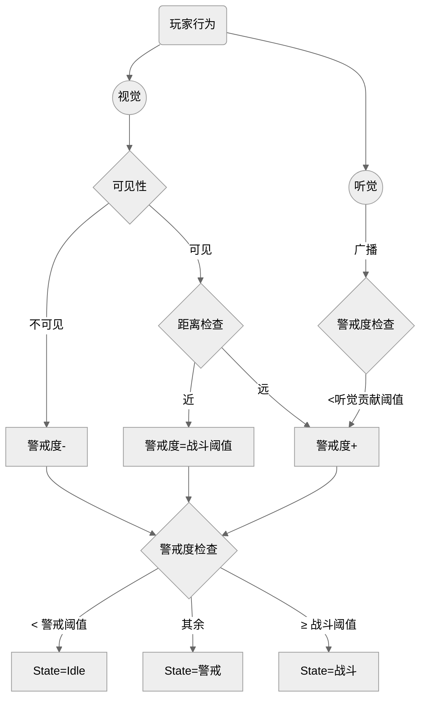
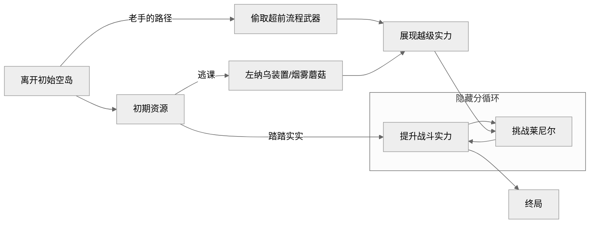
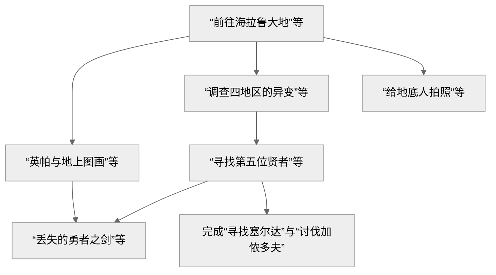

> 还在评估翻修价值！当初没有真的弄懂要写什么

本文假定读者已了解前作《塞尔达传说：旷野之息》，并对王国之泪也有一定了解。因为机制互相耦合，所以不能确保每个名词被解释后才被提到~~为什么不拓扑排序~~。
## 引入
旷野之息可以说是笔者所游玩过的游戏中独一份的白月光。2023年，饱含期待地，玩家迎来了它的续作王国之泪，如今也已是两年前了。在时间的检验下，关于王国之泪这款游戏究竟如何，大家都有了结论。对于笔者而言，刚拿到游戏，畅快地一天玩上十小时的时候，是相当快乐的。但热情消散后，回想起自己的体验，很多时候，我都会想说“这不是和从前一样吗”，又有很多时候甚至还不如从前。本作确有一些地方不尽如人意，而这就使得它没有达到我的提升预期。而这是为什么呢？本文将详细拆解分析**王国之泪的改进与遗憾。**
## 基础
### 乘法交互
任天堂在GDC2017里提出了“乘法交互”。回顾一下：在游戏中，有玩家的处境和一些目标。玩家有许多手段用于达成目标，总的可能性为玩家行动$$\times$$环境$$\times$$物体。实际上就是说，达成目标的手段比起设计，更接近一种涌现，存在着许多连开发者都未曾设想的可能。

笔者自己亲身体会后，大概将其理解为这样一个过程的结果：

首先，要有一个奖励，玩家会将它视为一个目标。这里假设它是一座神庙吧。它闪着光，有很远的裁剪距离，玩家很容易看见。

接着，把神庙布设到一个位置，考察周围的环境。在这里，把它放在一座山的山顶。山的一面陡峭，而且下面是流速很快的河流，另一面坡度较平缓，有大路。

最后，考虑附近的物体，作为地形中本就有的小的关卡，大路上有一些怪物，河流对岸有一个木筏可供玩家使用。

当把这些组合起来，再考虑到玩家可能的行动，就有极为丰富的可能性了。核心在于，这里面的环境和物体并不必为解锁神庙这个谜题本身而设计，只是把各类环境和物体放在合理的位置，就能自然产生一些谜题。这些谜题千人千面，并不完全能符合最开始摆放神庙时的设计思路。在上面的例子，我们会想到，玩家可以渡过河流后爬山上去，或者走正路击败或者避开怪物来到山顶。但玩家完全可以点燃一些材料，利用上升气流，不怎么费力地飞上去。这也许是意料之外的（实际上大概率不是），但它完全在设计之中。最终，玩家所能玩到的谜题是涌现出来的，这就是乘法交互了。

乘法交互作为旷野之息设计的基石，在王国之泪中也继续发挥着作用，甚至有了更大的状态空间。只需要知道：在旷野之息，战斗和探索是乘法的。而在王国之泪，不仅战斗和探索，道具也完全是乘法的。
### 物理驱动
在游戏引擎中，物理交互的世界里的对象被抽象为“Actor”。事实上物理引擎是基于一些牛顿力学（也许是拉格朗日力学）工作的，其本身能很好地处理一些物理交互，维护系统里的状态。

为了实现乘法交互，需要在物理引擎里真正尝试去模拟什么，而不只是刻意的去实现。在GDC2024，任天堂给出的例子是，对于一个电机带动齿轮的例子，他们不是只播放一个动画然后设置物理参数，而是真的让电机的扭矩带动齿轮。

不过，实际上，并不是所有那么东西都不那么刻意。作为例子，浮空石能抵抗重力就是一个典型，作为一个病态的Actor，令物理引擎和开发者头痛。Gameplay并不能完全不依赖于设计者从外部加入的粗暴的物理量，这就使得游戏里的物理系统不再孤立，可能导致奇怪的事情发生。

下面的视频是GDC2024里的一个玩笑。形象地演示了整个过程。

<video width="640" height="360" controls> <source src="/assets/post-images/totk-gdc2024-physic.mp4" type="video/mp4"> </video>

为了做到物理驱动，实际上需要大量的调优。但可以见到的是，物理驱动的效果绝对是惊人的。它是实现乘法交互的基础，为玩家提供了极大的状态空间，搭建展现左纳乌装置创意的舞台。
### ECS 
ECS即Entity Component System，是游戏程序设计上的概念。简而言之，是一种将事物视作数据与组件的集合，并交由不记录数据的系统管理的视角。虽然无法知道王国之泪的游戏代码实现，但笔者认为有很大概率使用了ECS，这是实现乘法交互的得力武器。为了实现乘法交互，往往不能当一个物体叫做“鸭子”时才把它视作是鸭子，而是只要它可以像鸭子一样叫、一样有用，就把它当作一种鸭子合适，否则游戏开发者要编码极大的状态空间，这是不可能的。

关键的是，玩家，整个游戏暴露的接口也是一种ECS。假如关卡的设计希望玩家在这里造一艘船，玩家会知道，他需要能在水上漂浮的组件和能用于水上的动力组件，仅此而已。他不需要单独掏出一个叫做“船”的道具。于是玩家和开发者能达成默契，尽管抽象层次完全不一样。当玩家也进入组合的思维，乘法交互才能真的被玩家体验到。
## 道具
### 分类
林克的道具格有限。弓箭、盾、武器格子是可以扩充的。
如果不加说明，林克可以把道具从道具格里取出来，扔到开放世界里去。
#### 防具
从NPC购买或开宝箱获得。提供防御力，装备时应用性质，当装备一套套装还可以获得套装效果。不能从背包里取出，但可以卖掉。
#### 弓箭、盾、武器
从怪物手上、地形布景处拾取，NPC锻造、购买或开宝箱获得。

弓箭提供战斗的远程攻击，需要同时具有弓和箭矢。弓拥有耐久度，射箭需要消耗箭矢。在王国之泪里，箭矢只有木箭。

盾提供战斗中的防御，自身具有防御力，承受攻击将损失耐久度。此外，还可以踩盾滑行，也需消耗耐久。

武器也就是近战武器，提供战斗中的近战攻击，自身具有攻击力，拥有耐久度。
#### 材料
从怪物身上、龙身上、地形布景或开宝箱获得。用于兑换、烹饪或者余料建造。可以手持。有些可以食用。具有余料建造攻击力。
#### 料理
烹饪、NPC奖励或购买获得。可以食用。
#### 左纳乌装置
从扭蛋机处或开宝箱获得。无法拾取地图上不是胶囊的左纳乌装置。
#### 重要道具
从各种任务处获得。不能从背包里取出，也不能卖掉。
### 耐久度
武器、弓箭以及盾具有耐久度。耐久度的设定实质上是为了让玩家在闲逛时有额外的动力。
### 词条
弓箭、盾、武器、防具还有料理可以拥有词条。除了防具和料理，随道具本身出现的词条由一套隐藏分机制控制，随机出现。下面给出**随机词条**的表格。

| 词条       | 应用道具种类  | 稀有度  | 效果              |
| -------- | ------- | ---- | --------------- |
| 攻击力提升（大） | 武器，弓箭   | 蓝（金） | 增加攻击力3-5（6-10）  |
| 盾防护提升（大） | 盾       | 蓝（金） | 增加盾防御力3-5（6-10） |
| 耐用度提升（大） | 武器，弓箭，盾 | 蓝（金） | 增加耐久度3-5（6-10）  |
| 速射       | 弓箭      | 金    | 蓄力时间减少          |
| 5连发      | 弓箭      | 金    | 一次射出五支箭         |
| 远距离投掷    | 武器      | 金    | 投掷距离变远          |
| 结束暴击     | 武器      | 白    | 攻击循环的最后一击暴击     |

有关防具和料理的词条固定出现，可称之为**增益词条**。当这些效果由料理提供时，会有持续时间的限制。这些增益词条不能无限制地叠加，往往有1级到3级的上限。因为种类很多，这里取一些有代表性的。

| 词条      | 来源              | 效果             |
| ------- | --------------- | -------------- |
| 能源持久    | 左纳尼乌姆套装的任意一件    | 电量消耗减少+1级      |
| 俯冲机动力提升 | 滑翔套装的任意一件       | 俯冲时水平移动速度提升+1级 |
| 火焰防护    | 防火套装的任意一件/火神兽兵装 | 特高温的抵抗+1级      |
| 攻击力提升   | 许多许多            | 攻击力提升乘区增益+1级   |
| ……      | ……              | ……             |

### 特性
弓、武器、防具以及材料都有特性。其中，用高亮文字清晰指出的是战斗特性，而用白色描述暗示或者没有提及的特性是隐藏特性。不过，即使是战斗特性，也是可以不体现在道具描述文案里的，这里依照按下左键切换武器界面的蓝色字体描述。
列出一些战斗特性的典型：

| 特性         | 来源     | 效果                                |
| ---------- | ------ | --------------------------------- |
| 在即将损坏时威力提升 | 近卫系列武器 | 耐久小于等于3时，武器面板*2                   |
| 突击攻击威力提升   | 王族系列武器 | 林克时间突击时，武器特性的乘区设为2                |
| 击败瘴气的驱魔之剑  | 大师之剑   | 面对加侬时基础攻击力变为60，攻击不消耗耐久，可以打回加侬的投射物 |
| ……         | ……     | ……                                |

隐藏特性非常容易被发现，在余料建造时，也非常有用。这里也列举一些：

| 隐藏特性          | 来源     |
| ------------- | ------ |
| 遭受冲击时爆炸并范围性放电 | 黄玉     |
| 让箭矢追踪敌人       | 各类眼珠   |
| 攻击时恢复血量       | 多种白龙材料 |
| ……            | ……     |

在前作的基础上，增加了在特性上的自由度，这当然也是为紧接着的系统埋下的伏笔。

### 余料建造
余料建造是这样的系统：给定基座（武器和盾），可以将大多没有自己的AI（看起来不像活着的动物）的游戏对象附加到基座上，得到的新道具拥有基座的战斗特性而拥有余料的隐藏特性，能保留基座的随机词条，攻击力是基座攻击力和余料攻击力之和。

基于组合，游戏中的道具被极大地丰富了。下面给出一些有趣的例子。

---
##### 岩石锤子
余料建造任意武器+小块岩石就可以让武器拥有岩石的钝器属性了，对矿脉的破坏力会增强。
##### 冷气果剑
余料建造单手剑+冷气果。挥砍命中时，冷气果爆炸，造成冰属性的效果。
##### 黄玉剑
余料建造单手剑+黄玉。挥砍时，施放一个漂浮的电球投射物。

---

也许很容易注意到，黄玉和冷气果在这里的行为没有保持一致。挥砍命中时它们理应都会遭受冲击而爆炸，但黄玉剑却表现得像一个法杖。笔者称之为**余料特化**。对于一些特定的组合，并不按照最初的规则来结合基座和余料的特性，而是产生了其它模组。这也是提高道具丰富度的手段，给相似余料做出差异化，避免多种余料显得像是复制粘贴。

余料建造也可以提升道具的耐久。基座道具有一个耐久上限，而全新的道具的耐久度并未达到这个上限，需要附加余料才行。这是符合直觉的设计，当我附加新的组件上去，原来的道具被加固，变得更结实了。

最后，余料建造道具可以被拆解，只需在一始村花费20卢比，这就带来了很低的试错成本。往往会有玩家尝试把武器拼到武器上，这样有可能使得珍贵的武器变成余料而变相失去它（因为它已无法在最终的道具体现自己的战斗特性），而现在只需小小的代价就能将珍贵的武器分解下来。低试错成本鼓励玩家多尝试不同的组合，不囿于固定的几种搭配。

此外，射箭时可以选择林克携带的材料，让箭矢附加上余料的攻击力和隐藏特性，是一种比较受限的余料建造，替代了前作的属性箭矢。
### 总结
在前作的基础上，通过组合式的设计，王国之泪中产生了极丰富的道具。又借助余料特化，提供了一些令人眼前一亮的小设计。

任天堂的设计目标也许是让一系列道具的获取驱动探索，探索与此同时回馈足够多（但不一定好）的道具，玩家只需要在路上一边捡道具一边战斗，探索和战斗就能借助道具串连在一起，拥有适宜的节奏，整个探索的心流不会被道具刷取的问题破坏。在这一点上的改进，王国之泪做得相当好，余料建造加持的道具系统实际上同时也作为一个加快游戏节奏的角色，符合玩家习惯在近几年的变化。

然而，实际上，余料建造使得一些道具变得没用了。王国之泪里只有少数武器拥有钝器的隐藏特性，但是如果使用余料建造，每个武器都能变成钝器，类似上面的例子“石头锤子”。这在事实上导致，本来有价值的道具因余料建造而变得没用。而从直觉上，余料建造应该只会使得所有道具都变得更有用才对。

此外，还有一个有趣的看法。在游戏整体的美术风格上，拥有余料建造道具系统是破坏性的。林克会背着、拿着各种各样古怪的东西。想象林克背着弹簧盾的样子，简直太奇怪了。这种不协调的元素组合导致沉浸感被破坏，间接削弱了探索的心流体验。而这种心流体验正是前作旷野之息的突出点。
## 战斗
### 基础
#### 生命值
与多数游戏的生命值一样。林克的每颗心是4点生命值，初始拥有3颗心，用祝福之光兑换或者通关神殿提高生命上限，最多拥有40颗心。但考虑到优先分配给精力，实际上一般是38颗。

额外的，林克有一个满血保护，避免在前期被怪物轻松一击秒杀。
#### 受击
林克受到攻击会扣除生命值。计算时，会减去防具的防御力，并且每次最少扣除1点。
#### 攻击
装备近战武器时，按Y挥砍。仅当装备单手剑时，林克的左手不被占用。
攻击会消耗耐久。与旷野之息不同，如果这次攻击只是用于激活装置，不会消耗耐久。
长按Y会消耗精力进行蓄力攻击。
特别地，在空中攻击会替换成下劈，落地后可造成额外的范围伤害。
#### 拉弓
装备弓后，按ZR拉弓，在蓄力一段时间后松开ZR来射箭。
拉弓需要双手，手持弓时林克的左手也被占用。
特别地，在空中拉弓会获得林克时间。
#### 投掷
按ZL投掷。对于有投射物的武器，不会投掷武器本体而是发射投射物。也可以按上键，改为投掷材料。
#### 举盾
按住ZL注视。若装备盾牌，且林克的左手空闲，就可以举盾。举盾可以阻挡攻击，但会损失伤害减去盾防御力的盾牌耐久。同时，承受冲击力强的攻击林克也会进入硬直，无法挡住接下来的攻击。
#### 盾反
举盾后，按A就可以进行盾反的动作。盾反可以弹回部分投射物，弹回的投射物可以伤害怪物，若盾反对象通过近战攻击，则往往还可以造成比较大的硬直，甚至将敌人的武器击落。

盾反需要配合敌人进攻的时机，输入提前或滞后都会失败。输入提前，会得到比较强的惩罚，林克将受击。输入滞后，相当于只举盾不盾反，浪费攻击机会。

盾反成功时盾若不造成伤害，则不消耗盾的耐久。
#### 闪避
注视时，无论是否有举起盾牌，都可以让林克侧跳和后跳来闪避近战攻击。
闪避需要配合敌人进攻的时机，并且最好也配合敌人进攻的方向。
下给出一张表格，展示了正确的匹配。

| 侧跳       | 后跳    |
| -------- | ----- |
| 竖斩，前冲，下砸 | 横斩，横扫 |

闪避成功，林克会获得林克时间。闪避失败有两种情况。一种是闪得太远或者太早，不能触发林克时间，但也不会受伤。另一种是闪错方向或者闪得太晚，没有装备盾牌的情况林克会受击。
#### 林克时间
进入林克时间时，游戏世界的时间流逝速度变慢，但不影响林克自身的动作速度。例如，对林克而言，他感受到的自己的重力加速度变小，但他拉弓和挥砍的动作不会因此变慢。
若持有弓，将会消耗精力在空中射箭。与前作不同，前作旷野之息只要在林克时间持有弓并且滞空就会消耗精力。不能射箭或者落地时，林克时间结束。
若持有近战武器，将发动突击，连续挥砍，对怪物造成累计的冲击。挥砍结束或不能挥砍时，林克时间结束。与旷野之息不同的是，发动突击时林克是无敌状态，不会因被攻击而退出林克时间。
#### 暴击
击中弱点、武器损坏、结束暴击以及破冰都可以造成暴击，带来额外的伤害倍率和削韧冲击。
破冰造成的暴击为3倍伤害，其余暴击为2倍伤害。暴击实际不可叠加。
#### 偷袭
在敌人进入战斗状态时在**背后**发动偷袭，获得8倍的伤害倍率。

8倍伤害倍率能极大地减少耐久消耗，使得潜行玩法具有意义。
#### 攻击力提升
获得该增益词条，按等级获得伤害倍率提升，1级为1.1倍，2级为1.2倍，3级为1.5倍。
### 伤害乘区
在王国之泪中，所有不同类的效果都处于不同的乘区，乘区之间互相乘算后和攻击力相乘向下取整，再配合一些修正，类似下面的伪代码。

```fsharp
val attack: float
val damageBonuses: float array
val weaponType: Weapon
let weaponDamageFix: Weapon -> float = function
| OneHanded -> 1.0
| Spear -> 0.75
| TwoHanded -> 1.05
let damage: int = floor(attack * weaponDamageFix(weaponType) * damageBonuses[0] * damageBonuses[1] ..) 
```

如伪代码所示，会根据武器类型给予不同的伤害修正，单手剑为1，长枪为0.75，双手剑为1.05。

作为一个实例，来计算著名的“斩马刀”的伤害。

```
damage = floor(
	(49（攻击力提升大近卫双手剑+）+32（莫尔德拉吉克的颚骨）)
	* 1.05（双手剑）
	* 2（近卫双手剑即将损坏）
	* 2（耐久为1时的暴击）
	* 1.8（擅长骨武器）
	* 1.5（三级攻击力料理）
) = 918
```

白银莱尼尔的血量为5000，林克第一次骑上它可以攻击6次。精心设计下，林克可以轻松秒杀白银莱尼尔，前提是进行以上的小小build。
### 贤者能力
在通关时之神殿以外的神殿后，林克会获得贤者助战。贤者是具有自己AI的实体，不具有血量，会自动攻击仇恨林克的怪物，靠近贤者时按A交互，贤者距离较远时也可按下键吹口哨吸引。
贤者的具体能力如下：

| 贤者类型 | 自动攻击能力         | 交互能力                                                   |
| ---- | -------------- | ------------------------------------------------------ |
| 风    | 射箭攻击敌人的要害      | 触发水平风场，提供加速度，可以在空中使用                                   |
| 水    | 持枪攻击敌人         | 给予林克抵挡一次伤害的水护盾并使林克进入45s湿润状态，下次挥舞武器攻击会释放单次的水刃造成伤害       |
| 火    | 持双手剑攻击敌人       | 向前冲撞并爆炸，摧毁物品，可以在载具（林克所在的任意移动速度到达阈值的左纳乌装置）上使用           |
| 雷    | 持单手剑攻击敌人       | 对范围内林克发射的箭矢攻击的位置降下一次落雷攻击，贤者会蓄力提升攻击范围                   |
| 魂    | 用可以余料建造的双手攻击敌人 | 操纵魔像。魔像可以攻击、举盾、盾反。可以使用余料建造。魔像不会受到岩浆和瘴气的伤害，无视坠落伤害，会自动照明 |

### 元素攻击
继承自前作，王国之泪中至少具有五种不同的元素：水、火、电、冰、风。笔者认为，“光”也在此列。元素可以改变元素和物体的状态，带来有趣的乘法交互。

对于两个元素的排列，有的可以产生额外的交互，这也就是“化学引擎”。元素可以由道具的隐藏性质、左纳乌装置和贤者大量的获得，在开放世界也本就存在着。

必须指出，元素也可以和温度系统交互。
### 隐藏分数
林克击杀敌人时，会获得隐藏分数，隐藏分数会决定开放世界怪物的等级和部分奖励，代表着玩家的游戏进度。

每种敌人有固有的隐藏分值，隐藏分奖励次数，以及隐藏分技巧倍率。在击杀敌人时消耗这类敌人的隐藏分奖励次数，根据玩家是否达成某种动作以及无伤击杀计算隐藏分技巧倍率，并以此获得一定倍率的隐藏分值。
### 敌人AI
敌人通过视觉和听觉感知林克，对于单个敌人，当且仅当用视觉观察到林克时，才进入战斗状态，否则只是警戒。如果是成群结队的敌人，敌人间会互相传递仇恨。此时即便看不到林克，也会进入战斗状态。下面是对单个敌人的状态机示意。



### 战斗策略
王国之泪的战斗系统与前作几乎别无二致，只是通过一些手段，极大地削减了战斗难度。如何削减的呢？简而言之，在王国之泪里，大多数时候，林克没有必要用战斗系统来战斗。即使不可避免地要亲自出手，也有许多逃课手段。例如，在灵活运用道具系统的前提下，即使完全不懂如何闪避触发林克时间，也可以轻松打败敌人。

下面给出一些不完全只利用战斗系统本身，而是活用各个游戏系统来在战斗中取得优势的典型。

---
#### 利用视野
根据上面的的基础，可以知道，偷袭的收益非常高，而这要求玩家理解视野系统并掌握不被发现的技巧。在旷野之息中，往往可以通过扔炸弹、食物以及射箭等方式，也可以通过安静型提升增益词条来减少敌人的听觉输入并从背后接近。在王国之泪里，依然可以这样做，但变得不必要。因为王国之泪新增了道具烟雾蘑菇，其隐藏特性就是破裂后会释放大量烟雾，遮蔽敌人的视野。实际上强制敌人的状态为警戒。这时林克可以大摇大摆地绕到怪物的背后，发起带有8倍奖励的偷袭。

本质上，沿袭自旷野之息的传统做法是一个设计过的结果。因为只要不被怪物近距离看到，无论如何，单个怪物都不会进入战斗状态。但是，对于多个敌人聚集的怪物营地，因为敌人的朝向布设的设计，往往容易被其中一个敌人发现而广播仇恨，基本很难实现偷袭。王国之泪加入了烟雾蘑菇，遮蔽所有敌人的视野从而消解这一问题，极大降低了获取偷袭奖励的难度。
#### 利用道具
林克可以利用多种道具，在战斗中取得优势，增加了战斗的复杂性。例如混乱花，让范围内的非精英敌人互相攻击，往往可以轻松清理一群小怪。闪耀果可以秒杀骷髅类怪物，火属性可以秒杀冰类怪物，冰属性可以秒杀火类怪物等。前文的烟雾蘑菇当然也是例子。
#### 利用布景
与前作相同，经常可以利用开放世界怪物营地内或附近的布景帮助解决战斗，例如现成的火药桶可用于直接轰炸敌人，现成的水域可以将怪物推入淹没等。
#### 利用建造
林克不必亲自出战，可以建造多种左纳乌装置直接进行战斗，而自己在一旁静观其变。左纳乌装置需要成本，结合蓝图用胶囊或者矿石打造，这就需要玩家能顺利运营资源收集的循环。一旦进入这个阶段，战斗可以说毫无难度了。

---

自然，玩家也可以继续玩动作的那部分，这也是游戏所支持的。战斗系统的设计鼓励玩家进行思考，灵活变通，也鼓励玩家挑战高难度的动作。体现最明显的是，沿袭自旷野之息的怪物：莱尼尔。

在前作，击败莱尼尔的收益非常显著。正面击败莱尼尔要求玩家能灵活运用盾反、闪避和弓箭，而它掉落的奖励能优化玩家在整个游戏内的战斗体验，能正面击败莱尼尔代表玩家来到了全新的阶段，可以进入一个新的资源收集的循环，最终击败白银莱尼尔，获得游戏内综合上最强的武器。王国之泪没有改变这一点。不过与前作不同的是，在王国之泪中不正面击败莱尼尔的方式非常多，再加上林克大幅提升的数值，降低了挑战难度。

接下来，给出一个可行的（至少笔者自己这么玩）让林克变强的路径的示意图：



~~笔者不得不说，这在旷野之息中也基本成立，只是在王国之泪中做起来容易些，是换汤不换药。玩过前作的玩家可以完全依赖从前的路径，并在这个路径上获得更好的体验，其实也是好事。~~

### 总结
王国之泪具有简洁而不简单的战斗系统。它保证了大多数操作都是简单易学的，完全不要求玩家记忆复杂的攻击手法，只需要有足够的反应和一些锻炼，或者有打破常规的意识。

这样的战斗给了玩家充足的自由，对于一个目标，玩家往往有很多解，让林克和自己变强，收获快乐。这自然很好。但是，在这个过程中，是否失去了什么呢？

以游戏的最终战为例。人形的加侬多夫是游戏中少有的战斗体验优秀的人形敌人，这种敌人正是这两作缺失的。加侬多夫经过了非常精心的设计，会在战斗中切换多种武器，有独有的机制加侬时间，林克往往要连续完美闪避两次才能成功触发突击，带来不少新鲜感。加侬多夫还有能直接损坏林克盾牌的投射物，能永久扣除林克的生命上限，甚至有演出上令人惊讶的突破屏幕的血条……可以说，加侬是一个极具压迫感的Boss，玩家不容易通过堆资源而不背板一次通过他。

不过这一切皆有前提：林克好好地陪他玩动作游戏。

事实上，当林克足够自由，就是他来书写规则了。一旦林克摆出左纳乌装置，掏出弓箭，加侬多夫的战斗体验将不能有效区别于白银波克布林。玩家甚至不需要知道他怎么出招，仅仅需要用火箭盾上天，然后用五连发弓爆头，或者把看起来不可一世的魔王关在奇怪的绿色蓝图装置牢笼里……然后就能看一场紧张刺激的胜利CG。笔者相信，如果可以，大多数玩家会努力趋近于降低时间投入而提高收获，认真和加侬多夫打一场漂亮的战斗并不是首选，真是令人遗憾。

此外，贤者的设计也令人疑惑。贤者能力本身是好的，但触发的方式有严重的问题。任天堂为了保持游戏交互的简单易懂，不倾向于让玩家学习复杂的组合键，最终导致贤者能力的触发以一种难以使用而易于理解的方式呈现，令人遗憾。
## 建造
### 电池
装置消耗的自然回复资源，需要用能源结晶打造来提高回复上限。
### 装置
左纳乌装置基本是单一职责，而且功能比较正交。开发者预测了玩家的需求，定义了这些装置的行为。玩家可快速理解，并通过有限装置的组合做出好玩的东西，又不至于产生选择困难，或带来设计上的门槛。

| 类别  | 装置                   | 特性         |
| --- | -------------------- | ---------- |
| 动力  | 大小轮胎，风扇机，火箭，弹簧，热气球   | 提供运动的动力    |
| 载荷  | 翼，平板车，滑橇，浮游石         | 有特殊的物理属性   |
| 元素  | 放水栓，冰火雷龙头，灯，镜子，（风扇机） | 能制造元素与材料互动 |
| 能源  | 大小电池                 | 提供能源       |
| 约束  | 桩，不倒翁                | 提供物理约束     |
| 武器  | 光线头，大炮，计时炸弹          | 有比较高的战斗价值  |
| 操纵杆 | \                    | 可以控制载具     |
| 便携锅 | \                    | 可以烹饪       |
| 追踪  | 追踪平台车，魔像的头部          | 预置了AI      |

与左纳乌装置的交互很简单易用，只需要攻击装置就可以启动，把装置余料建造到武器或者盾上也可以沿袭原本的战斗模组来同时启动装置，而把装置附加在箭矢上也能产生一些有趣的效果，比如射出在特定位置停下的浮空石。

有的装置会消耗电量。对于连接在一起的装置，电量消耗是每种装置的电量消耗之和。对于每种装置，除了第一个装置消耗的电量为1倍，其余是0.5倍。即：若一个风扇机消耗电量为2，两个风扇机连接在一起的消耗是3，三个风扇机是4。这个设计的目的是优化玩家堆叠同种装置时的体验。例如玩家可能为了加快载具的速度在载具上使用许多风扇机，如果没有这样的优化，电池消耗会接近现在的两倍。
### 究极手
究极手是非常**伟大**的能力。可以移动物体，把物体粘连到其它可移动的物体上。

沿袭自前作的磁铁能力，究极手的作用对象从金属物品扩展到了几乎所有有移动组件的非生物游戏实体，让开放世界做到了“万物可交互”。启动究极手时会检测直线上的可达性，连接可达的物体。对于连接的物体，林克能（在物品本身受约束下）挪动物体的位置，绕世界的Up向量和Right向量旋转物体（足以表达所有三维旋转）。当物体与其它有效的物体距离足够近，究极手可将所操纵的物体粘连在最近的物体上。究极手最多可连接20个节点。

在究极手的帮助下，林克可以把上文列出的左纳乌装置任意地粘连起来，拼接出各种各样的装置，以非常易用的方式。

也需要提到，究极手是许多解谜关卡所依赖的能力。
### 蓝图
蓝图能力是究极手的部分代替。频繁拼装相同的装置令人厌烦，所以游戏提供了蓝图，可以用被放到开放世界的左纳乌装置浮现出从前的拼装。若装置不足，会自动用左纳尼乌姆填充。
### 总结
建造与战斗和探索深度耦合，是为玩家提供尽可能大的自由而存在的，可以认为是对乘法交互里“物体”的巨大扩展。与机械建造类游戏不同，在王国之泪中建造不是目的而是手段。大多情况下，玩家建造装置不只是为了新奇好玩，而是借助组合的装置来优化自己的探索战斗体验。而设计师在鼓励玩家进行建造时，通常也是用建造作为特定关卡的环节。

在物理驱动的基础上，王国之泪给玩家的并非真正的物理规则，而是一种近似的符合直觉的规则。最明显的例子就是在一些2D平台跳跃游戏中，玩家可以在空中调整落点，而这从物理上不是那么合理，但从直觉上相当过得去，能有效优化玩家的体验。在王国之泪里的操纵杆
## 探索
于是就来到了王国之泪最重要的探索部分。王国之泪相比前作最大的不同，就是探索具有纵深。天空中加入了空岛，地面海拉鲁~~的整个拓扑结构惨遭破坏~~发生变化，加入了深穴，以及贯穿的洞窟、井下。深穴联通着地底。事实上，极大地提升了林克在降低高度的能力，在控制上也加入了俯冲，提升下降的速度，配合整体较大的纵深。不过，提升高度的能力则仍然是受限的，接下来会详细讨论。
### 精力
制约林克探索的数值，林克不消耗时会自动回复，用祝福之光兑换提高回复上限。
### 传送
除了部分特殊场合，一旦解锁传送功能，林克可在任何时候传送。在传送过程中，时间暂停，林克不会被攻击。
### 通天术
作为一个实例，通天术就是能提升高度的能力，但非常受限。通天术应用于范围内比林克高又不太倾斜的平面，对平面的材质（林克不能对尖刺使用通天术）和穿越后的空间也有要求。

通天术是非常实用的能力，在习惯之后使用的频率会比较高。在洞穴探索中，通天术能有效延续玩家的心流，玩家不需要沿途返回，也不需要传送到远处，破坏探索的节奏，只需用通天术就能来到洞外，钻出山顶。此外，通天术还承担了一些关卡设计。通天术和究极手是有交互的，可以用究极手把平面搬运到高处，再使用通天术，这样就能在不能爬墙时抬升自己的高度。
### 倒转乾坤
倒转乾坤是前作静止器的超级强化版，同样能消除物体的动量，失去了动量累计而增加了还原物体状态的功能，会逐渐还原物体的旋转和位置，最多还原20秒。

同样的，倒转乾坤也是实用的能力，不止解谜用途。例如倒转提前飞出去的载具的状态，玩家可以拯救自己辛苦拼装的装置。也可以用倒转乾坤配合刚才的通天术小技巧，这样即使没有支点也能抬升高度。
### 环境参数
#### 温度
在王国之泪的的开放世界和神庙中都具有温度。温度作为游戏世界的固有机制，能在非常多方面制造交互，例如融化冰、把兽肉变成冻兽肉。场景里固有的元素、时间、天气以及林克的道具，都可以影响温度。

温度除了在乘法交互上的作用，还能直接制约林克的探索。当温度太低或太高时，林克需要有对应的装备或料理带来增益词条，否则会损失生命值。当然，直接改变温度也能达到目的。
#### 风力
即使没有明显的方向风场，游戏中也存在有向的风力。

风力作为游戏物理的一环，实质上是乘法交互要求的。毕竟假如要为了特定的区域风场生造概念，这就不是乘法交互提倡的Pattern了。于是游戏里就有了无处不在的风力场。
#### 天气
天气系统继承自前作，实际经常作为探索本身的阻力。

作为地表和天空环境的一部分。

下雨时，岩壁会变滑，难以攀爬。雷雨天气，金属武器会引雷。
### 开放世界
#### 软引导
任天堂在CEDEC2017分享了引力和三角形法则的概念。读者应当对此都十分了解，这里简单回顾一下。

引力，可以视为一种隐晦的引导，是明显的正向收益，或者只是不同寻常的东西，吸引玩家靠近。不同物体的引力可以有所不同。

三角形法则，是指场景中图形形状对于玩家的引导。三角形遮蔽兴趣点可以在玩家探索时慢慢揭露出来，而矩形则会显得兴趣点突然出现而体现出更大的惊喜感，梯形则是暗示顶部有潜在的奖励。

由引力和三角形法则，建立了软引导。软引导不以单独强硬的规则约束玩家**不能做什么**，也不会有清晰的文字指引玩家**能做什么**，获得什么奖励。软引导就只是那样一个有趣的物体或结构，摆在那里。也许发出光，也许发出声音，也许只是外观可疑。但玩家总能用也许是再寻常不过的先验知识，或者在前面的游戏积累的经验，判定这样的兴趣点。

在三角形法则下，漫游的玩家在某一位置会见到一些兴趣点，根据引力选择接下来要前往的方向，也许是一个脑中的Check List。在前往目标的途中，玩家还会继续见到从前被遮住的兴趣点，因此需要变更计划。在反复观察-评估-变更-行动的循环中，玩家具有积极的自由，所去的地方是自己选择的，所以他们基本能选择不去对于自己太危险或者太无趣的区域，而不被外物所限制，要求他走一个所谓的“正轨”，因而他们容易把挑战与自己的能力相匹配，获得持续的心流体验。

在王国之泪中，引导依旧照此工作。玩家在见到场景中的兴趣点，依然会给自己规划一个Check List，按一定优先级来探索。但三角形法则是否生效则是有争议的。因为在王国之泪里林克会具有很高的高度，已经很难遮住玩家的视线了。在这种情况下，三角形法则是否还能起到引导作用，给玩家带来惊喜呢？
#### 地表
地表并不是王国之泪中玩家首先到达的地点，不过作为新手引导的初始空岛，其实是精心设计的大箱庭，玩家在里面的行为是可以比较容易预测的。所以按照一般情况，玩家真正开始探索开放世界还是从地表开始的。

地表地形仍是前作中的样子。在旷野之息中，林克要用双脚丈量大地，但如今是王国之泪，玩家有很多花哨的东西可用，让人不禁怀疑这套地图是否还能起到原有的作用。

实际上，刚从初始空岛跃下的的玩家通常没有多少左纳乌胶囊，也不会有蓝图功能。他们是无法驾驶载具驰骋海拉鲁大陆的。对于现在的他们，王国之泪和旷野之息尚且没有多大的区别，原有的设计自然继续生效。
##### 道路
沿袭自前作的引导。如果林克骑马，因为马匹的AI设计会非常有动力留在道路上。道路附近会铺设零碎的大小兴趣点，连接的驿站和城镇则属于辐射范围极广的兴趣点。

因为道路在本作和前作区别不大，这里不多做回顾。
##### 鸟望台
前作的希卡塔进化成了本作的鸟望台。不需要攀爬到塔顶来解锁，但将林克抬升的高度反而增加了许多，通过发射的事情。

鸟望台连接着地表与天空，是前期探索天空的重要手段。在鸟望台将林克弹射到天空后，原本大地上的三角形法则就遗憾离场了。但它的作用会被新的设计接管：鸟望台附近通常会布设一些空岛，这一些空岛起到比较强的引导，但引向的内容并不能支持长时间的消费，玩家最终一定会回到地表。同时，林克在前期通常不具有特别多的精力来长时间滑翔，因此也不会接着抬升的高度走得十分远。最终仍然会回到大地上三角形法则的引导。
##### 落石
玩家在探索时会偶遇落石，借由对其倒转乾坤，林克可以抬升自己的高度。一些落石能帮助玩家来到空岛，另一些只是略微改变探索节奏。落石在落下时会有拖尾特效，实际上作为一种兴趣点存在。
##### 龙之泪
龙之泪是大型的地上彩绘，玩家在远处时容易看出图案，是利用“三角型法则失效”来专门进行引导的兴趣点。

调查龙之泪后会播放一段回忆，帮助玩家了解剧情。
##### 破魔神庙
破魔神庙是闪着绿光的兴趣点，在调查后解锁传送。

进入破魔神庙后将会传送到专门的箱庭关卡。
##### 洞窟
在玩家玩到中后期时，有机会完全挣脱大地上三角法则的束缚，快速沿直线前往兴趣点。为了让玩家仍能感受到适宜的挑战性，一些兴趣点会被藏在洞窟中。这样，无论玩家的移动能力多强，都需要仔细寻找洞窟的入口。而进入洞窟内，就变成了四处受限的箱庭，载具不能在关卡没有特殊设计的情况下继续带来显著的优势。与鸟望台的设计一样，洞窟也在三角法则失效的边缘尝试继续维护一种引导。

洞窟一般奖励神庙、防具、魔犹伊，还有洞窟探索本身需要的光亮花和炸弹花。光亮花在地底会非常有用，而相对安全的洞窟中大量产出光亮花。

在洞窟探索结束后，对于单向的洞窟，利用通天术就可以离开，不必把走过的路再走一回，对于联通山体的洞窟，往往能从没有到过的出口出去，洞窟顺带起到了引导作用，都有助于帮助玩家维持心流。
##### 深穴
深穴是非常明显的兴趣点，会向外释放红色的瘴气，彰显了危险性。跳入深穴就可以来到地底。

值得一提的是，有的深穴入口也许没那么明显，甚至伪装成洞窟。但因为地底和地面的对应关系，玩家能确定某一片区域一定会有深穴，进而需要更仔细地去搜索，带来了一些乐趣。
#### 天空
海拉鲁的天空是空旷的，兴趣点集中在分散的空岛群，空岛群是分隔开来的独立的箱庭，中间广阔的空域几乎不会安排有可玩的内容。除开主线要求的初始空岛还有风之神殿、水之神殿，空岛探索基本是包含一部分奖励驱动的，和好奇心驱动并行。

空岛群由实质上多个小房间（体现为空岛）组成，提供防具、神庙、扭蛋机、Boss站场地。对于没有直接连接着的房间，一般有现成的左纳乌装置或者其它提供物理交互的设施帮助玩家前往。这时在空岛之间移动也成为了一个实质上的谜题，玩家如果有自己的左纳乌装置造的载具则可以。
##### 破魔神庙
空岛上也有一些破魔神庙。
##### 残旧的地图
已经提到，空岛的内容不足以支持长时间的消费。空岛上存在一些宝箱，奖励是藏宝图，在地图上标注地表或者地底的宝箱位置，而位置不是指向的奖励本身，实际上是吸引玩家离开空岛继续探索，作为天空与地表、地底的联动存在。
##### 左纳乌装置制造机
投入左纳乌能源，可兑换为左纳乌装置胶囊。
##### 特殊采集物
此外，在天空获得的左纳乌胶囊和向阳草、闪耀果，也是地底探索极其重要的资源。
#### 地底
地表和天空的各种线索都会指向地底。这是一个大而空的区域，兴趣点的密度比较低。对于前期的玩家，地底难度颇高，没有光照，靠步行难以探索，怪物的威胁也很强。而在玩家进行到中后期时，才容易发现，地底实际上是一个专为左纳乌装置定制的大型Playground，特殊的环境实际也为设计并改良装置提供了动力。

根据制作组访谈，地表的地图似乎是根据地表的地形一一映射，河流映射为无法穿越的墙壁，高山映射为低谷，盆地映射为险峰，驿站映射为莱尼尔，神庙映射为树根。

通过对地底的探索，玩家可以获得大量资源，回馈整个游戏流程。
##### 瘴气
在地底，瘴气被大量布设，存在于地形和怪物上。接触到瘴气或者受到瘴气攻击不扣除生命值，改为临时扣除生命上限，需要回到地表或天空自然恢复，或者使用向阳草料理。

在前中期，瘴气实际上限制了玩家在地底的探索时间，鼓励玩家跳入深穴后快速进行探索然后返回地表或折返树根。

后期，探索地底后可以获得带有瘴气回复增益词条的防具，载具和魂之贤者也可以让林克可以在瘴气上移动，玩家可以长时间在地底停留。
##### 破魔树根
在地底布设的传送点，可以发光并点亮一定区域的地底地图，帮助探索。在树根的光下也可以恢复瘴气损失的生命上限。

树根与地表的神庙一一对应，对地底的探索可以直接以此回馈到地表，用容易寻找的树根来定位难以寻找的神庙。
##### 废矿&矿脉
地底的主要建筑为废矿，作为兴趣点，会有左纳尼乌姆和防具的奖励。有一些废矿会有依盖队占领，提供更多对地底探索有意义的信息。废矿也包含任务，重要的蓝图功能就是在中央大废矿获得的。

除了专门的废矿，地底也分布着其它矿脉，经常会有怪物看守。

矿石是重要的资源，用来兑换能源结晶进而造成电池，也能用于蓝图复现装置。
##### 通天术布景
地底的穹顶不能使用通天术。对于引导玩家使用通天术的场合，地底布设了特殊的布景，作为兴趣点，可以从这个布景通往地表一些有趣的地方。

作为例子，主线里的克洛格森林首次进入时必须要用此方法。
### 神庙
与前作一样，王国之泪有专门的箱庭地图，叫做神庙，作为奖励驱动的关卡存在。通过神庙可以获得祝福之光，提升血量和精力上限。

神庙是相对封闭的，一般所有的谜题都可以就地取材通过。除了部分战斗环节外，一般也不对林克的血量和武器做要求。对于孑然一身之战神庙，进入时，林克的道具会被限制，在通过之前只能使用神庙内的所给的道具，类似前作的剑之试炼，有较多的生命上限在关卡内会有明显的优势。

神庙一般也贯彻乘法交互，会涉及到战斗系统和建造系统，玩家可以活用林克的能力和道具达成目标，不必囿于某个特定的解。

除了初始空岛的四座神庙，神庙都是可选的，不需要通过它们就可推进游戏进度。
### 总结
前文提到的部分可以整理为下图：


多数情况下，玩家需要反复在天空、地表、地底之间来回穿梭，维持资源上的互补。

此外，还有一些没有提及的兴趣点，比如克洛格。在王国之泪里新增的背包克洛格要求玩家前往可能与玩家原有目的地完全不同的区域，能让探索节奏变得更有趣，像这样的设计还有很多，比如不期而遇的元素龙，星星碎片等等，但这里并不打算展开，因为其并不能体现区别于前作的特色。
## 任务
最后，再来谈谈任务吧。

多数时候，会认为任务是典型的**强引导**，但王国之泪的一些迷你挑战和大多数神庙挑战是稍微软一点的**弱引导**，目标并不特别明确，偶尔只是通过提示给出。
### 迷你挑战
迷你挑战大多数指引玩家寻找某种道具，探索区域，也能塑造海拉鲁的风土人情，能提高开放世界的空气感。
### 神庙挑战
顾名思义是关于神庙的挑战。奖励是确定的，解锁一座神庙。有趣的是，即使玩家不去接取就直接解锁了神庙，任务也会直接算作完成，也许是为了帮玩家省去再去接取的麻烦。
### 情节挑战
情节挑战帮助寻找一些重要地点甚至解锁游戏系统，蓝图系统就是经由情节挑战获得的。
### 主剧情挑战
主剧情挑战即为主线剧情，完成初始空岛的指引后除了打败魔王外的任务都是可选的。



其中调查四地区的异变中四个地区的顺序可以任意调换。玩家一共要解决五个神殿。假如没有完成，在讨伐加侬多夫时会遭遇神殿Boss的车轮战，也不能达成真结局。

值得一提的是，神殿没有在探索环节提及，因为它完全依赖于主线，不做主线是无法提前探索的。在这里稍微提一下，好让神殿知道自己很重要。
## 能够从中借鉴什么？
来到了压轴的环节。大致拆解了王国之泪之后，做了相应的分析，应当有所收获。在王国之泪里，我们能够从中借鉴什么？

回顾以上的拆解，总结最明显的两点就是：**提速**和**个性化**。

提速就是指整个游戏的速度加快，包括而不限于探索和战斗。玩家在兴趣点之间移动的速度变快，可以直接用载具走直线，低消耗击杀一头莱尼尔的时间也从前作的一分钟甚至几分钟加快到10秒。

这样做的好处：
- 能给玩家带来更密集的反馈
- 能让玩家在碎片时间里就完成一个兴趣点
- 能在游戏内容实质上更丰富的情况下不过分要求时间投入
- 能在Switch的30s录制时间内体现更多值得分享的内容，活跃社区

实际上因为疫情的结束，居家时间减少，玩家对快节奏的要求有所提高，适当提高速度是大势所趋。非单机的开放世界游戏其实也在做一些“反旷野之息”的加快节奏的调整。

个性化是指游戏提供很高的自由度。武器的余料建造十分自由，左纳乌装置的建造也十分自由，每个玩家都可以有感觉上可以区别于他人的玩法。

这样做的好处：
- 给玩家带来“我的玩法与众不同”的积极反馈
- 延长内容的消耗时间，喜欢的玩家会花时间去尝试新花样
- 提高玩家的分享欲，活跃社区

此外，王国之泪相比前作，明显地在开放世界里划分了更多的箱庭，分界比从前明显，虽然听上去没那么纯粹，实际上这也是更现代的思路，相较于只能在神庙内提供有趣的箱庭关卡。

最后，需要提到的是，也存在不太适合借鉴的部分。对于大多数游戏制作组，制作究极手和这些左纳乌装置的成本也许是不可接受的，仅仅作为开放世界的一个扩展玩法（很显然，前作没有这些也运行得很好）。做一个这样的地底世界用来产出资源和给玩家当试验场也难以接受。虽然任天堂透露地底世界是程序化生成的，但这不能抹除全部工作量，尤其是程序仍需优化地表快速跳入地底场景时的地图加载。
## 结语
现在，对于王国之泪的分析已经结束了。该回到最初的问题。**遗憾**是什么呢？

旷野之息的突破点在于，它创造了一个**几乎**万物可交互的开放世界。但它的交互没有那么丰富，笔者曾见人评论说“恶作剧玩几次就会腻了”，实然如此。

王国之泪做了什么呢？它把大部分的“**几乎**”去掉了，交互也被极大地丰富。但也许质变还不是时候，笔者从中只能见到量变。或者说：问题就在于，旷野之息原本即是相对自洽的。尽管林克的能力的设计并没有王国之泪成熟，不那么耦合而精妙，但它依然提供了一个优雅的体验，玩家已经很自由。任天堂耗费也许五年时间，告诉了大家，他们有能力在这之上建构更大的自由，让海拉鲁的乘法交互更进一个维度。游戏确实变得更好玩了，林克在原本的自由之上获得了貌似更大的自由。但这种自由就会带来快乐吗？

已经在战斗的部分提到过，拥有这样的自由实际有其损害。大多数神庙的解谜体验也被破坏。因为所贯彻的乘法交互，一个压力板受力就会被按下，玩家可以不利用神庙提供的谜题而是拿出多发弓发射炸弹花知道冲击力。因为神庙不禁用玩家余料建造的左纳乌装置，火箭盾可逃课大量神庙……这样的例子数不胜数。不可否认，当玩家发现这些技巧时，他们也会像解谜通过一样快乐。但在他们日后套用同一种方式逃课许多关卡时，他们就只是平白失去了解谜的快乐而已。

而这就是所谓的**遗憾**了：假如自由扩大的结果是失去自由，玩家失去了一份独特的快乐，那我们是否还要继续相信，玩家是自由而幸福着的呢？
