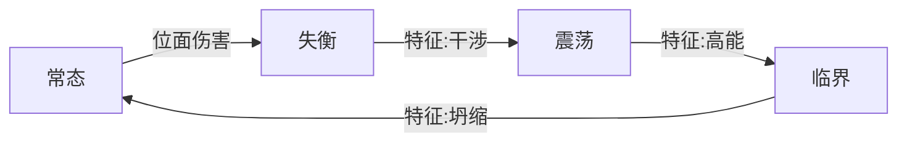

 
## 总览
我希望尝试做一款“有意思”的二次元风格回合制游戏。

---
作为最初的思路：

**宝可梦**PvP玩法很有深度，我个人也很喜欢，但过于随机的体验往往偏偏为旁观者带来笑容，也即直播效果很好，但自己玩的时候偶发高血压。我希望能吸收里面的一些联防、先读的优质体验，并且PvE化，以宝可梦对战的“感觉”作为最基础的体验。

**杀戮尖塔**不考虑肉鸽，打牌本身也很好玩。其中的意图显示，也见于其它游戏，其实适合优化上述先读的体验，是合适的PvE化。

同时，对于我游玩的2代来说，了解到玩家似乎并不那么爱玩小卡组。可能的理由是，小卡组对出牌顺序要求没那么高，更容易达到无限或者差不多无限，状态空间也更小一些。我认为我也应考虑让回合制别那么一板一眼，一回合只能动一下，而是引入能量/能量机制，限制玩家连续打出技能的序列，并且用更精心设计的技能组加上可配置的少量技能来优化一下状态空间上的问题。

最后，还要考虑一下**异度之刃**和**星穹铁道**。显然，如果是一个二次元游戏，它应该有更能“展现角色”的一些在玩法上的配合，比如特殊的大招特写，连携攻击等等。虽然我不见得要走到这一步，但姑且也考虑进来。因而我希望加入异度之刃的连携攻击，同时因为回合制我们已有，因此新加入的连携攻击改用ATB跑条来维持新鲜感，避免两个战斗模式完全一样。

---
同时也考虑了很天真的Core Loop：

通过回合制战斗推进主线，获得金币，用金币来进行养成，增强实力从而攻克后续的主线以及旁支挑战。需考虑局内和局外的构筑来优化金币的投入，并依照关卡实时调整角色和技能组合。看旮旯小剧情也算是动力之一，但只是单箭头，并非循环的组成。

为了进一步提升趣味，应该考虑有一些随机性的肉鸽模式。

---
游戏的操作方式：

简单的点击和拖拽，节奏不快，不怎么讲究点按的时机。

---
我应该是先动手去做再说的类型，因而这里的内容很多是我照着已经做出来的东西写的，但仍然写得比较初级，我只能寄希望于后续还能再更新几次。

顺带一提，读取配置的代码也是我写（vibe）的，实际是用蹩脚类型检查DSL生成JSON，因此这里的表格只是看着玩的。

---
制作进度：游戏初步可玩，能设计一些关卡验证我的系统。

总之，确实很初步。

（游戏的旮旯界面，女主在低效地介绍游戏机制）
## 战斗系统

（战斗系统界面，包含以下的大多机制。左上为行动条，左下是我方角色，右上为敌人，右下为能量和技能）
### 核心
**输入**：技能的预输入和即时输入、角色站位的对换操作

**约束**：血量、行动值（AV）、能量（AP）

**反馈**：卡牌特效，数字等

从OODA来考虑：

**观察**：玩家需要观察敌我面板数值和行动序列，以及敌人的意图指示

**判断**：基于观察到的信息，需要预测接下来可能发挥到的事情。相较于一般的判断是更缓慢的

**决策**：考验决策的质量，与前一步预测结合，进一步展开思考量

执行的部分微不足道，包含点击和拖拽。

### 基础概念和结构
#### 行动

`Actor`
- `ActionValue: int` 行动值，在行动序列上的位置
- `Speed: float32` 行动速度，在行动序列上排序和重置行动值的依据

`ActionInfo`
- `IsInserted: bool` 为插入行动的标识
- `Actor: Actor` 行动的单位

Actor能够是一个站在场上的单位，也可以是其它的场地效果，甚至倒计时。大体来讲，星穹铁道的行动条能装什么，这里也需要能装什么。

#### 行动序列和插入行动
`actionSequnce: List[ActionInfo]`
`insertedActions: Queue[ActionInfo]`
有一个有序的行动序列，和插入行动队列。在插入行动队列为空时，行动序列中的目标行动，否则插入行动队列里的单位行动。

这里的插入行动不具有优先级，先进入队列的行动就先发生，避免产生优先级的心智负担。

【插入行动】也就是说星穹铁道里的【额外回合】，它比行动序列上的行动更优先。插入行动在UI中永远显示在所有普通行动之前。
#### 轮

`chronoCycle()`

默认的战斗模式。负责反复的攻防与强化，达成生存而最终攻坚。

在战斗的最开始，进入一个【轮】。【轮】结束时，如果没有单位存活，则战斗结束，否则进入新的【轮】。

在【轮】中所有单位在行动序列上**不放回**地依次行动，依照速度和先制度排序。

1. 最开始，把双方单位放置在行动序列上，依照速度（次要）和先制度（主要）排序。
2. 双方先后进入预指令阶段，敌人的预填充先于玩家的预填充。
3. 在所有的预填充结束后，第一个单位消费指令。仅当没有预填充指令可消费时，单位需要即时地填充指令，在此期间战斗暂停。
4. 如果没有单位存活，【轮】结束。否则去除第一个单位，让第二个顶替第一个的位置，以此类推，重复第2步
5. 没有单位可以行动时，【轮】结束。

【轮】是类似宝可梦的传统回合制体验（实际宝可梦也不那么那么“传统”）。不过行动可以被一些方式手动地放回到行动序列上，因而其实不一样。

敌人的指令需要比玩家先决定，这样玩家在选择技能时才能看到敌人的意图指示。
#### 乱流

`chronoTurbulence()`
- `RemainingActionValue: int` 剩余行动值
- `Owner: BattleUnit` 所有者

特定条件下，例如开启乱流触发技能时，将更换到此战斗模式。时序乱流拥有阵营和拥有者，还有它内部的总行动值（AV）。负责倾泻伤害，扭转战局。

在【乱流】中部分单位在行动条上有**放回**地依次行动，依照行动间隔排序。

1.  最开始，把相关单位放置在行动序列上，依照行动值（AV）排序
2. 将AV最小的单位提升到AV=0，其它单位的AV和时序乱流的总AV减去这个最小AV单位原先的AV
3. 第一个AV=0的单位拿出并行动，战斗暂停，即时地填充指令，获得指令后消费。
4. 刚才行动的单位的AV被重置，被插入回行动队列，位置是最后一个AV$$\le$$它的单位的之后。
5. 时序乱流的总AV不足以减去下次需要减去的AV时，时序乱流将要结束，时序乱流的拥有者释放乱流终结，时序乱流正式结束。

### 伤害结算
#### 伤害的类别

分为六类：
- 物 `Kind.matter`
- 理 `Kind.logos`
- 时 `Kind.time`
- 空 `Kind.space`
- 光 `Kind.light`
- 暗 `Kind.dark`

设计属性为了鼓励玩家多切换队伍，同时这是构成联防的基础设施。

##### 类别相性表

| 进攻\防守 | 物   | 理   | 时   | 空   | 光   | 暗   |
| ----- | --- | --- | --- | --- | --- | --- |
| 物     | 平   | 平   | 劣   | 劣   | 优   | 优   |
| 理     | 平   | 优   | 平   | 平   | 平   | 平   |
| 时     | 优   | 平   | 劣   | 优   | 劣   | 平   |
| 空     | 优   | 平   | 优   | 劣   | 平   | 劣   |
| 光     | 劣   | 平   | 优   | 平   | 劣   | 优   |
| 暗     | 劣   | 平   | 平   | 优   | 优   | 劣   |

**理**不和其它类别交互，只克制自己。呈现**时空**克**物**，**物**克**光暗**，**光暗**克**时空**的石头剪头布模式，**时空**和**光暗**分别进行内部互相克制。
#### 实在伤害 `damage_realistic_damage`
实在伤害受到防御力影响，基于攻击力造成实在伤害。实在伤害的单位是r。
#### 位面伤害 `damage_planar_damage`
位面伤害不造成目标血量的减少，而是基于位面攻击累计位面损伤值，无视防御力。位面伤害的单位是p。
> 位面攻击无视防御，改用攻击方自己可控的实体系数，但需要击破位面抵抗才能出伤。
> 同时，位面攻击受到类别相性的影响更剧烈。

位面伤害为玩家带来更具变化的战斗节奏，带来一次天然的瞬间出伤，并衔接控制状态。

#### 单位 `BattleUnit`

###### 字段`prim_stats: PrimStats` 
**说明**：原始（**PRIM**itive）值，静态配置得到

| 字段                            | 说明     |
| :---------------------------- | :----- |
| `base_hp: int32`              | 基础生命值  |
| `base_atk: int32`             | 基础攻击力  |
| `base_def: int32`             | 基础防御力  |
| `base_pat: int32`             | 基础位面攻击 |
| `base_prs: int32`             | 基础位面抵抗 |
| `base_spd: int32`             | 基础速度   |
| `base_crit_rate: float32`     | 基础暴击率  |
| `base_crit_dmg: float32`      | 基础暴击伤害 |
| `base_causal_score: int32`    | 基础因果分数 |
| `base_entity_factor: float32` | 基础实体系数 |
| `base_kind: Kind.Flags`       | 基础类别   |

###### 字段`live_stats: LiveStats` 
**说明**：当前值，在战斗过程中实时更新

| 字段                            | 说明    |
| :---------------------------- | :---- |
| `lv: int32`                   | 当前等级  |
| `hp: int32`                   | 当前生命值 |
| `planar_injury: int32`        | 位面损伤  |
| `action_value: int32`         | 行动值   |
| `planar_status: PlanarStatus` | 位面状态  |
| `alive: bool`                 | 存活标识  |
| `extra_life: int32`           | 额外生命  |

###### 字段`final_stats: FinalStats` 
**说明**：最终值，完全由计算得到，被修改不具有意义

| 字段                       | 说明    |
| :----------------------- | :---- |
| `max_hp: int32`          | 最大生命值 |
| `atk: int32`             | 攻击力   |
| `def: int32`             | 防御力   |
| `pat: int32`             | 位面攻击  |
| `prs: int32`             | 位面抵抗  |
| `spd: int32`             | 速度    |
| `crit_rate: float32`     | 暴击率   |
| `crit_dmg: float32`      | 暴击伤害  |
| `entity_factor: float32` | 实体系数  |
| `causal_score: float32`  | 因果分数  |
| `kind: Kind.Flags`       | 伤害类别  |

###### 字段 `common_skills: List[Skill]`
**说明**：三个通用技能
###### 字段`turbulence_skills: List[Skill]`
**说明**：三个乱流技能
###### 字段 `ability: Option[Skill]`
**说明**：天赋技能
###### 字段 `item: Option[Item]`
**说明**：道具，可空，它可以被消耗
######  字段`ornaments: List[Ornament]
**说明**：饰品，提供数值和一些机制，三个槽位

#### 位面损伤机制
当位面损伤`live_stats.planar_injury`超过位面抵抗`final_stats.prs`，会进入位面失衡状态，下一次行动被跳过，并立即把自身的位面抵抗转化为生命值削减，此次伤害称为失衡伤害。在下下次行动时，解除位面异常。在位面异常状态下，位面伤害会转化为生命值削减。（星铁的击破和超击破，明日方舟的精神损伤等等常见该机制）

#### 特征
`type TagSet = Set[Tags]`
*这里不得不用数学，我目前认为这样比较好*
特征是标签集合的可爱版本说法。

>我们用单个标签的特征的讨论替换对单个标签本身的讨论。也就是对一个标签$$x$$，我们用$$\{ x \}$$代替它，这样就不需要考虑用“包含”还是“属于”。

对于一个要求的特征$$Y$$，特征$$X$$满足它，当且仅当$$Y$$是$$X$$的子集。

例子：要求的特征Y是“光类别 坍缩 位面伤害”，造成的伤害的特征X是“光类别 坍缩 协同 位面伤害”，符合Y是X的子集条件所以是满足的。

#### 位面异常
处于位面异常状态的敌人会以实体倍率结算位面损伤到生命值。

位面异常涵盖多种具体的状态，并且通过一定规则实现状态的转移：
- 位面失衡`PlanarStatus.disorder`：首先进入的失衡状态。
- 位面震荡`PlanarStatus.fracture`：失衡的敌人受到【干涉】特征的攻击后触发。
- 位面临界`PlanarStatus.critical`：震荡的敌人受到【高能】特征的攻击后触发，额外跳过一次行动。如果受到坍缩特征的位面伤害，这次位面伤害的最终伤害提升`sqrt(max(0, 100-CS))/3`，并立即结束一切位面紊乱效果。

基本上抄袭了破防-倒地-浮空-猛击。将破防从可能的概率抵抗改为数值检验，也就是嫁接星铁击破到这里的破防的触发。

位面异常需要是递归结算的。例如使用【干涉】特征的攻击击破敌人时，如果在击破敌人后还溢出一些伤害，这些溢出的伤害会结算到生命值，并且敌人也会在【位面失衡】后立即进入【位面震荡】。但无法通过同时附加【高能】特征来再次进入【位面临界】，对于单段的伤害，因为溢出伤害已经结算完毕。

下图展示了状态转移的图。需要注意的是，除了常态以外的任何状态都会因位面紊乱自然结束而转移到常态。但这画在图里非常丑，所以没画。

位面异常增加了博弈空间，双方不再是“你打我一下我打你一下”，而是可以通过控制连续实现“我一直打”，同时玩家也要提防自己进入位面异常状态。

与崩铁的超击破队不同的是，这里的玩法更有主动性。崩铁的超击破队实际有些奇怪：它的超击破需要在击破后触发，超击破需要最大化敌人被击破的占比来提高输出。但是，这样实际亏损了击破伤害。崩铁自然懂，他们设计了大丽花，在击破前也允许造成超击破伤害，但超击破也因此失去了自己的特色。而我们这里可以直接手动解除敌人被击破的状态。

实际上，位面伤害就是延迟的出伤。在失衡后，可以迅速打出震荡和临界然后坍缩，获得高倍率同时失去敌人的位面异常状态，也可以保留敌人的位面异常一直进行输出。这之间没有绝对的优劣。如果能有低【因果分数】，也就是这里的【元素精通】，并且有高额倍率技能，打出坍缩就很好。如果反之，拥有高频率低倍率，或者【因果分数】很低，那么就不该去打坍缩。

#### 饰品
饰品提供3个部位，每个部位都具有一个数值增幅，且属于一个特定的套装。如果套装含有套装效果，那么还需检测套装的配套情况来给予这个效果。

部位I：修正生命/位面抵抗常数项

|            | C级          | B级          | A级         |
| ---------- | ----------- | ----------- | ---------- |
| 生命值常数项（α）  | HP(100, 1)  | HP(100, 2)  | HP(100,3)  |
| 位面抵抗常数项（β） | PRS(100, 1) | PRS(100, 2) | PRS(100,3) |

部位II：修正暴击率/速度常数项

|           | C级  | B级  | A级  |
| --------- | --- | --- | --- |
| 暴击率常数项（α） | 15  | 20  | 25  |
| 速度常数项（β）  | 10  | 15  | 20  |

部位III：修正攻击力/位面攻击百分比

|            | C级  | B级  | A级  |
| ---------- | --- | --- | --- |
| 攻击力百分比（α）  | 10% | 25% | 40% |
| 位面攻击百分比（β） | 10% | 25% | 40% |

套装效果是2件套效果和3件套效果选其一。

饰品提供调速能力，增加构筑丰富度。凑齐套装效果也可以提高阶段性目标。词条的α-β词条随机性提供一点额外的乐趣。
#### 乱流触发充能
小队共享的资源，上限为300。达到上限后可由1号位激活时序乱流。
#### 选取
为了使用技能，需要先选取。
选取包含：
- 自我选取
- 单体选取(敌/我)
- 群体选取(敌/我)

#### 技能
##### 选取约束
使用技能需要选取，而选取的对象有所指定，称其为选取约束。

选取约束是一个对，由两个部分组成，其一是选取的阵营，其二是选取的数量。

可选的阵营有：
- 任意一方
- 我方
- 敌方
- 全场

可选的数量有：
- 单体（单个的敌人）
- 特定个单体（紧挨着的x个敌人，x是给定的，x >1）
- 任意群体（任意个紧挨着的x个敌人，x>=1）
- 全体

特别地，具有两个不同于上述组合的选取约束，称为“自己”

选取约束彼此之间具有兼容性，按这样的规则：
- 选取约束“自己”兼容(C, D)，当且仅当D是全体。
- 对于任意的选取约束，其兼容(C, D)，当D是全体。
- 对于一个约束(A, B)和另一个约束(C, D)，(A, B)兼容(C, D)，当B和D兼容、A和C兼容。兼容是不可交换的。

对于阵营，兼容的规则为：

| A\B  | 任意一方 | 我方  | 敌方  | 全场  |
| ---- | ---- | --- | --- | --- |
| 任意一方 | T    | F   | F   | F   |
| 我方   | T    | T   | F   | F   |
| 敌方   | T    | F   | T   | F   |
| 全场   | F    | F   | F   | T   |

对于数量，兼容的规则为：

| C\D   | 单体  | 特定个单体                          | 任意群体 | 全体  |
| ----- | --- | ------------------------------ | ---- | --- |
| 单体    | T   | F                              | T    | T   |
| 特定个单体 | F   | T when C.x = D.x,  F otherwise | T    | T   |
| 任意群体  | F   | F                              | T    | T   |
| 全体    | F   | F                              | T    | T   |

这些规则的准则是：x兼容y，等价是否能从x中得到y

例子：
我方单体是否与全场全体兼容？ T
敌方任意群体是否与我方单体兼容？ F
敌方单体是否与敌方任意群体兼容？ T

选取约束对玩家可能很晦涩，但这里写的只是方便程序，实际玩家可形成靠谱的直觉，只要规则本身具有soundness。
##### 通用技能
在轮与乱流中都可以使用，分别触发不同的效果，可学会三个。

对于大多数通用技能，在乱流中会变为几类特定效果。此外的通用技能的乱流效果是特殊的。
##### 乱流技能
仅在乱流中可以使用的技能，可学会三个。使用时同时触发嵌入的通用技能的乱流效果。
乱流技能会自动将对应编号的通用技能嵌入，当且仅当乱流技能的选择约束兼容通用技能的选择约束。
##### 乱流触发

（选择乱流触发指挥者的界面）

在【轮】中触发200行动值的【乱流】，需要消耗全队共享的资源“乱流触发充能”。此行为称为“乱流触发”。

在点按乱流触发按钮时，场外单位【乱流触发单位】立即获得一个【插入行动】。在这个插入行动里，弹出界面要求选择乱流触发的指挥者，指挥者是小队成员之一。

若处于不能行动的状态，不能作为乱流触发的发起者。如果所有小队成员均不能够行动，则乱流触发按钮被禁用。

乱流触发是作为【轮】中【乱流触发单位】的行动，不算做发起者的行动。

乱流触发会以插入行动的方式使用“乱流触发技能”，视为在【轮】中使用，并重置能量到最大值。即使不是（预）输入阶段也可以使用乱流触发。

在时序乱流的末尾，“乱流触发技能”会再次被使用，视为在【乱流】中使用，并重置能量到最大值。这次的技能称为乱流终结，会对敌方全体造成伤害，并获得依照乱流分数的最终伤害加成。

#### 防御
攻击可以被防御。

在【轮】中，玩家操控的单位可以使用一些技能进行“防御”。防御会使得受到的实在伤害转化为位面伤害。规则类似如此：
- 当受到的伤害为自己的抵抗类别: 受到位面伤害的比率为0%，反弹位面伤害的比率为100%。
- 当受到的伤害为自己的弱点类别: 受到位面伤害的比率为66%，反弹位面伤害的比率为10%。
- 当上面两例均不满足: 受到位面伤害的比率为34%，反弹位面伤害的比率为34%。
#### 小队
我方是三人小队。

在【轮】中，可以交换队伍的排列，实现联防。这个操作是免费的。
#### 交换站位
在【轮】的预输入阶段可以交换我方单位的站位。该动作没有任何消耗。
#### 指令
为了实现动作，需要有指令。指令涵盖一个单位将要做的事情。
#### 行动
单位的行动是消费指令的过程，同时消耗行动值（时间），此外还需消耗作为资源的能量。

如果能量不足，行动会被跳过。

行动实际需要的行动值为

$$
\text{ActionValue} = \lceil\frac{10000}{max(\text{SPD}, 1)} * K_{\text{av}} + C_{\text{av}}\rceil
$$

在【乱流】中，行动之后，行动值会按照上述公式重置。

##### 能量
制约行动序列的资源。最多可以拥有3点，每次行动开始都会消耗1点。

能量机制下，不同种类行动的比例是受控的。

##### 普通行动
默认情况下来自行动序列中的行动称为普通行动。

回复1能量。

##### 行动重插入
调整一个行动在行动序列里的位置，维持行动序列对于排序Key的有序。新的位置永远是在该行动的行动值+1之前的最后一个位置。

##### 立即行动
立即行动的目标无论如何都会来到行动序列中下一个将要行动的位置，发生立即行动。

例子：

行动序列为 A B C D
- 若A使用您请先使得D立即行动，行动序列变为A D B C（不会挤掉A，2号位置是下个行动的）
- 若D拥有Hook使得“出场时，立即行动”，行动序列会变为D A B C（1号位置是下个行动的）

##### 行动提前
只有时序乱流存在该概念，减少行动值并重新插入到行动序列里。

##### 百分比行动提前
只有时序乱流存在该概念。

等同于行动提前$$\lfloor \text{ActionValue} \cdot x \rfloor$$

##### 插入行动
存在一个插入行动队列。优先级高于行动序列。
插入行动可以是固定执行某些指令，也可以是让玩家自己输入指令。

#### 乱流分数
在我方小队成员触发的【乱流】中进行某些行为可以获得乱流分数

| 行为     | 得分  |
| ------ | --- |
| 行动     | 50  |
| 立即行动   | 30  |
| 造成伤害   | 10  |
| 触发位面异常 | 100 |

Finished 小于400分

Cool 小于1000分

Great 小于2000分

Excellent! 小于4000分

Lunatic!!! 大于等于4000分

分数会直接为终结伤害提供增益，最终伤害的系数是`1+(9*分数)/(分数+3600)`

#### 天气
目前即场地
#### Overkill
时序乱流中的敌人最后的生命值被清空后，不会立即结算死亡，而是可以继续承受伤害，累计Overkill。

#### 意图指示
预输入指令阶段，玩家可以看到敌人的意图指示，分为：
- 不能行动
- 准备使用进攻技能
- 准备使用战术技能（强化、开场地）
### 数值
#### 基础值
公式里，基础值的字母是全小写
- 生命 `hp`
- 攻击力 `atk`
- 防御力 `def`
- 位面攻击 `pat`
- 位面抵抗 `prs`
- 速度  `spd`
此外，还有特殊的属性
- 因果分数`cs`
#### 最终数值
公式里，最终数值的字母是全大写.

$$C$$ - Constant，增加的固定值
$$K$$ - Coefficient，增加的比率值
$$M$$ - Modifier，乘区

需要注意，为了好看，看起来是$$K$$的东西初始值为$$1$$！
等级的取值为1到10闭区间的整数

$$

\begin{aligned}
\text{HP} &= \left\lfloor (1.96 \text{Lv}^2 + 1) \times \text{hp} \times 1.6926 \times K_{\text{HP}} + C_{\text{HP}} \right\rfloor \\
\text{ATK} &= \left\lfloor (1.96 \text{Lv}^2 + 1) \times \text{atk} \times 0.2262 \times K_{\text{ATK}} + C_{\text{ATK}} + 50.43948 \right\rfloor \\
\text{DEF} &= \left\lfloor (1.96 \text{Lv}^2 + 1) \times \text{def} \times 0.2262 \times K_{\text{DEF}} + C_{\text{DEF}} \right\rfloor \\
\text{PAT} &= \left\lfloor (1.96 \text{Lv}^2 + 1) \times \text{pat} \times 0.2262 \times K_{\text{PAT}} + C_{\text{PAT}} + 50.43948 \right\rfloor \\
\text{PRS} &= \left\lfloor (1.96 \text{Lv}^2 + 1) \times \text{prs} \times 0.9813 \times K_{\text{PRS}} + C_{\text{PRS}} \right\rfloor \\
\text{SPD} &= \left\lfloor \text{spd} \times K_{\text{SPD}} + C_{\text{SPD}} \right\rfloor
\end{aligned}

$$

>  等级是平方项，10级是1级的66倍，这个平方没那么明显
>  攻击力和HP的系数，代表着一个1.0倍率的攻击伤害并不会很高，因为有堆叠次数的手段
>  相应的，为攻击力增加了额外的常数项，保证前期伤害
#### 对群系数
能攻击多个目标的技能有多种对群系数，对于n个目标中的单个，伤害按此修正：
- 反比型（均摊）：$$\frac{1}{n}$$
- 抛物型：$$\frac{1}{\sqrt{n}}$$
- 双曲型：$$\frac{\sqrt{(n+3)^2-7}}{3n}$$
- 线性型（真群攻）：$$1$$

总伤是如上的公式乘n

设计时可以考虑的倍率修正：
- 反比型（均摊）：$$1.6$$
- 抛物型：$$1.0$$
- 双曲型：$$1.0$$
- 线性型（真群攻）：$$0.5$$

> 直接用系数决定伤害
#### 实在攻击伤害
计算公式为$$\lfloor M_\text{Base} * M_\text{Damage} * M_\text{Crit} * M_\text{Defense} * M_\text{Kind} * K_\text{AOE} \rfloor$$，其中
$$M_\text{Base}=m*\text{ATK} + C_\text{Damage}$$
$$M_\text{Damage}=X.K_\text{Damage}-Y.K_\text{DamageReduce}$$
$$M_\text{Defense}=\frac{\text{DEF}(100,X.Lv)}{\text{DEF}(100,Y.Lv) + \text{DEF}(Y.def,Y.Lv)}$$`
$$M_\text{Kind} = \begin{cases}1.2 & \text{如果 } \text{优} \\ 1.0 & \text{如果 } \text{平} \\ 0.8 & \text{如果 } \text{劣} \end{cases}$$
#### 实体倍率值
$$K_\text{Entity}$$

一般是0.5。可以变化。
#### 位面攻击伤害
计算公式为$$\lfloor M_\text{Base} * M_\text{Damage} * M_\text{Crit} * M_\text{KindModifier} * K_\text{AOE} \rfloor$$，其中
$$M_\text{Base}=m*\text{PAT} + C_\text{Damage}$$
$$M_\text{Damage}=X.K_\text{Damage}-Y.K_\text{DamageReduce}$$
$$M_\text{Kind} = \begin{cases}2.0 & \text{如果 } \text{优} \\ 1.0 & \text{如果 } \text{平} \\ 0.5 & \text{如果 } \text{劣} \end{cases}$$

## 关卡系统
### 选关界面

抄袭我们明日方舟、PvZ2那类传统手游，折线式关卡。用关卡名前缀代表难度。
### 奖励界面
通过关卡后集中显示关卡的收益。
## 养成系统
### 埃
养成系统的资源
### 资源消耗
#### 单位升级

| 等级   | 1   | 2   | 3   | 4   | 5   | 6    | 7    | 8     | 9     | 10     |
| ---- | --- | --- | --- | --- | --- | ---- | ---- | ----- | ----- | ------ |
| 资源   | 0   | 4   | 16  | 64  | 256 | 1024 | 4096 | 16384 | 65536 | 262144 |
| 累计资源 | 0   | 4   | 20  | 84  | 340 | 1364 | 5460 | 21844 | 87380 | 349524 |

### 资源获取
#### 关卡通关
每关首次通过可获得埃。关号为a-b，a,b从1开始，收益为公式`18^(a-1)`
再次挑战只能获得四分之一的收益，向上取整。

每大关收益如下

| 大关   | 1   | 2   | 3    | 4     | 5      |
| ---- | --- | --- | ---- | ----- | ------ |
| 资源   | 5   | 90  | 1620 | 29160 | 524880 |
| 累计资源 | 5   | 95  | 1715 | 30875 | 555755 |

当触发Overkill时，获得额外奖励，关卡的收益为原先的两倍。

如果不触发奖励，靠这些很难养成10级角色。
## 存档系统
这里就主要是接近程序的部分。

`LevelSystem`:

| 字段         | 类型                | 解释      | 需要存档 |
| ---------- | ----------------- | ------- | ---- |
| Characters | `Set[Characters]` | 已经解锁的角色 | 是    |
| Coins      | `int`             | 埃       | 是    |
| LastLevel  | `int,int`         | 解锁的最后关卡 | 是    |
| Items      | `List[Item]`      | 道具背包    | 是    |
| Ornaments  | `List[Ornaments]` | 饰品背包    | 是    |
|            |                   |         |      |
## 饰品制造系统
1 32 1024
制造时指定部位和稀有度，随机决定种类（alpha/beta）

## 当前填充内容
### 特征
##### 正电
使得受实在伤害的单位获得效果*正电荷*，最多可叠加3层。新添加的*正电荷*会记录这次的伤害值，与已经记录的伤害值做加权平均，如果不存在已有的记录则直接设置记录值。若其已拥有一定层数的*负电荷*，则消耗对应层数的*正电荷*和*负电荷*，由消耗的电荷的施加者造成0.15r伤害，这个伤害不会超过记录值的30%。

##### 负电
使得受实在伤害的单位获得效果*负电荷*，最多可叠加3层。新添加的*负电荷*会记录这次的伤害值，与已经记录的伤害值做加权平均，如果不存在已有的记录则直接设置记录值。若其已拥有一定层数的*正电荷*，则消耗对应层数的*正电荷*和*负电荷*，由消耗的电荷的施加者造成0.15r伤害，这个伤害不会超过记录值的30%。
##### 照射
##### 冲击
##### 干涉
##### 爆炸
##### 协助
##### 召唤
### 天气
优先级越小越好，最好的是0。
#### 场-电场
- 优先级 10
- 场上单位造成的带有“正电”或“负电”特征的实在伤害分别提升50%。
- 场上单位造成的同时带有“正电”和“负电”特征的实在伤害降低100%。

#### 场-创生之地
- 优先级 0
- 所有单位的防御力降低23%，实体倍率增加0.13（*炙热尘埃*）。

#### 场-光域
- 优先级 10
* 场上单位光类别的伤害提升34%，暗类别的免伤提升50%。

### 通用技能

| 名称      | 时序轮效果                              | 时序乱流效果     | 选择约束 | 倍率             | 倍率2 | 属性  | 特征  |
| ------- | ---------------------------------- | ---------- | ---- | -------------- | --- | --- | --- |
| 提升      | 选择一个我方目标，使其立即行动。                   | *协助*       | 我方单体 |                |     | 理   |     |
| 集中攻击    | 对敌方单体，造成带有使用者属性的0.8r+0.8p的伤害。      | *强化*       | 敌方单体 | 0.8r+0.8p      |     |     |     |
| 分散攻击    | 对敌方全体，造成带有使用者属性的0.8r+0.8p (I)的伤害。  | *强化*       | 敌方全体 | 0.8r+0.8p(I)   |     |     |     |
| 广域攻击    | 对敌方全体，造成带有使用者属性的0.5r+0.5p (II)的伤害。 | *强化*       | 敌方全体 | 0.5r+0.5p(II)  |     |     |     |
| 集中攻击-A  | 对敌方单体，造成带有使用者属性的{倍率}的伤害。           | *强化*       | 敌方单体 | 0.96r+0.64p    |     |     |     |
| 分散攻击-A  | 对敌方全体，造成带有使用者属性的{倍率}的伤害。           | *强化*       | 敌方全体 | 0.96r+0.64p(I) |     |     |     |
| 广域攻击-A  | 对敌方全体，造成带有使用者属性的{倍率}的伤害。           | *强化*       | 敌方全体 | 0.6r+0.4p(II)  |     |     |     |
| 集中攻击-B  | 对敌方单体，造成带有使用者属性的{倍率}的伤害。           | *强化*       | 敌方单体 | 0.64r+0.96p    |     |     |     |
| 分散攻击-B  | 对敌方全体，造成带有使用者属性的{倍率}的伤害。           | *强化*       | 敌方全体 | 0.64r+0.96(I)  |     |     |     |
| 广域攻击-B  | 对敌方全体，造成带有使用者属性的{倍率}的伤害。           | *强化*       | 敌方全体 | 0.4r+0.6(II)   |     |     |     |
| α-跃迁    | 自己的伤害提升50%，持续8个时序轮，最多叠加2层。         | *猛击*       | 自己   |                |     | 物   |     |
| β-电离    | 自己的伤害会附带“负电”特征，持续8个时序轮。            | *负电*       | 自己   | 0.05r+0.05p    |     | 物   |     |
| γ-激发    | 自己的暴击率提升34%，持续8个时序轮，最多叠加2层。        | *猛击*       | 自己   |                |     | 物   |     |
| 电场制造    | 开启电场，持续5个时序轮。                      | 参考乱流-电荷消耗I | 不选择  | 0.05r+0.05p    |     | 物   |     |
| ζ-提升    | 自己的暴击率提升34%，持续8个时序轮，最多叠加2层。        |            |      |                |     | 物   |     |
| α-跃迁    | 获得效果：造成的伤害提升50%，持续8个时序轮，最多叠加2层。    | *猛击*       | 自己   |                |     | 物   |     |
| 协议-坍缩触发 | 对敌方单体，造成带有使用者属性的{倍率}的伤害。           | *强化*       | 敌方单体 | 0.8r+0.8p      |     |     | 坍缩  |
| 协议-高能触发 | 对敌方单体，造成带有使用者属性的{倍率}的伤害。           | *强化*       | 敌方单体 | 0.8r+0.8p      |     |     | 高能  |
| 协议-干涉触发 | 对敌方单体，造成带有使用者属性的{倍率}的伤害。           | *强化*       | 敌方单体 | 0.8r+0.8p      |     |     | 干涉  |
| 光域制造    | 开启光域，持续8个时序轮。                      | *揭露*       | 不选择  |                |     |     |     |

### 乱流技能

| 名称        | 时序乱流效果                               | 选择约束 | 倍率             | 倍率2          | 属性  | 特征  | 备注  |
| --------- | ------------------------------------ | ---- | -------------- | ------------ | --- | --- | --- |
| 强化        | 造成的伤害提升34%。该效果在当前行动后移除，且不可叠加。        | 自己   |                |              |     |     | 伪技能 |
| 猛击        | 暴击率增加20%。该效果在当前行动后移除，且不可叠加。          | 自己   |                |              |     |     | 伪技能 |
| 协助        | 选择的单位所造成的伤害提升34%。该效果在单位行动后移除，且不可叠加。  | 我方单体 |                |              |     |     | 伪技能 |
| 正电        | 造成的伤害额外添加正电荷特征。该效果在当前行动后移除，且不可叠加。    | 自己   |                |              |     |     | 伪技能 |
| 负电        | 造成的伤害额外添加负电荷特征。该效果在当前行动后移除，且不可叠加。    | 自己   |                |              |     |     | 伪技能 |
| 集中乱流攻击    | 对敌方单体，造成带有使用者属性的{倍率}的伤害。             | 敌方单体 | 0.8r+0.8p      |              |     |     |     |
| 分散乱流攻击    | 对敌方全体，造成带有使用者属性的{倍率}的伤害。             | 敌方全体 | 0.8r+0.8p(I)   |              |     |     |     |
| 广域乱流攻击    | 对敌方全体，造成带有使用者属性的{倍率}的伤害。             | 敌方全体 | 0.5r+0.5p(II)  |              |     |     |     |
| 集中乱流攻击-A  | 对敌方单体，造成带有使用者属性的{倍率}的伤害。             | 敌方单体 | 0.96r+0.64p    |              |     |     |     |
| 分散乱流攻击-A  | 对敌方全体，造成带有使用者属性的{倍率}的伤害。             | 敌方全体 | 0.96r+0.64p(I) |              |     |     |     |
| 广域乱流攻击-A  | 对敌方全体，造成带有使用者属性的{倍率}的伤害。             | 敌方全体 | 0.6r+0.4p(II)  |              |     |     |     |
| 集中乱流攻击-B  | 对敌方单体，造成带有使用者属性的{倍率}的伤害。             | 敌方单体 | 0.64r+0.96p    |              |     |     |     |
| 分散乱流攻击-B  | 对敌方全体，造成带有使用者属性的{倍率}的伤害。             | 敌方全体 | 0.64r+0.96(I)  |              |     |     |     |
| 广域乱流攻击-B  | 对敌方全体，造成带有使用者属性的{倍率}的伤害。             | 敌方全体 | 0.4r+0.6(II)   |              |     |     |     |
| 擢升        | 选择一个我方目标，使其立即行动。                     | 我方单体 |                |              | 理   |     |     |
| 抬升        | 选择一个我方目标，使其行动提前50%。                  | 我方单体 |                |              | 理   |     |     |
| 揭露        | 造成的光类别伤害提升50%。该效果在当前行动后移除，且不可叠加。     |      |                |              |     |     | 伪技能 |
| 光域攻击      | 对敌方全体，造成带有使用者属性的{倍率}的伤害。环境为光域时，倍率翻倍。 |      | 0.4r+0.4(II)   | 0.8r+0.8(II) | 光   |     |     |
| 乱流协议-坍缩触发 | 对敌方单体，造成带有使用者属性的{倍率}的伤害。             | 敌方单体 | 0.8r+0.8p      |              |     | 坍缩  |     |
| 乱流协议-高能触发 | 对敌方单体，造成带有使用者属性的{倍率}的伤害。             | 敌方单体 | 0.8r+0.8p      |              |     | 高能  |     |
| 乱流协议-干涉触发 | 对敌方单体，造成带有使用者属性的{倍率}的伤害。             | 敌方单体 | 0.8r+0.8p      |              |     | 干涉  |     |

### 道具：终末之钥
持有者的造成的召唤特征的伤害提升20%。

在触发时序乱流时，持有者的行动间隔减少6点行动值。
### 道具：Cosmera-5游记

每次登场和时序乱流时，暴击率提升50%，持续1个时序轮。

暴击伤害增加50%。（*涌思*）

### 道具：烘焙岁月
速度减少10点，位面攻击提高40%

*把故事放到烤箱里，也许某天就会香气扑鼻呢？*

### 饰品套装：返大地记
*Anodus ad Terram*
3件套：
每次登场和时序乱流结束时，获得效果**返大地记**：行动间隔减少，持续3个时序轮，不可叠加。

### 饰品套装：天空制造
*Sky-Fabricated*
3件套：
造成位面失衡时，获得效果**天空制造**。
坍缩位面异常时，若具有1能量，则消耗1能量获得一次插入行动。
**天空制造**：
暴击率增加30%。
持续1个时序轮，不可叠加。

### 饰品套装：无际漂流

3件套：
造成协同特征的伤害时，对命中的目标施加效果**乐园之种**：受到的伤害增加50%，持续1个时序轮，不可叠加。

### 饰品套装：长旅
2件套：
战斗开始时，获得效果**启程的信念**：速度提升100%，不可叠加。在行动后移除。

### 饰品套装：铭刻
2件套：
战斗开始时获得效果*人智的结晶*：造成的位面伤害提升100%。在行动后移除。

### 饰品套装：位面隔离套件
3件套：
因果分数增加100点，受到的位面伤害减少30%，造成的实在伤害提升100%。

### 单位：暮光（时）
*Vespera*
x.vespera

tag: 干涉 坍缩 连续行动 暴击 能量回复
#### 基础值
540

| hp  | atk | def | pat | prs | spd |
| --- | --- | --- | --- | --- | --- |
| 90  | 100 | 80  | 100 | 80  | 90  |

| cs  |
| --- |
| 50  |
#### 天赋：夜的序章

| 倍率  | 倍率2 | 属性  | 特征  |
| --- | --- | --- | --- |
|     |     | 时   |     |
##### Lv1: 
获得立即行动和插入行动时，暴击率增加40%。

在时序轮中：
- 暮光行动时，小队的乱流触发充能回复30。

##### Lv3: 
使敌人触发位面失衡或使精英敌人触发任意位面异常时，为小队回复2点能量。

##### Lv5: 
攻击处于位面异常状态的的目标时，造成的最终伤害提升50%。

#### 技能：
##### 乱流触发-一瞬永恒

| 倍率           | 倍率2 | 属性  | 特征  |
| ------------ | --- | --- | --- |
| 1.8r+1.8p(I) |     | 时   |     |

简略描述：暮光在暴击时有机会获得插入回合使自己继续行动。

开启**时序乱流-暮光**。
时序乱流结束时，对敌方全体造成1.8r+1.8p (I)伤害。

**时序乱流-暮光**：
- 暮光的攻击力和位面攻击提升30%。
- 暮光造成暴击伤害时，若至少拥有2能量，则消耗2能量以获得一个插入回合。

##### 通用技能

| 名称       | 时序轮效果                                                                                                                                           | 时序乱流效果                            | 选择约束 | 倍率          | 倍率2         | 属性  | 特征  | 学习方式 |
| -------- | ----------------------------------------------------------------------------------------------------------------------------------------------- | --------------------------------- | ---- | ----------- | ----------- | --- | --- | ---- |
| 白昼的结尾/黄昏 | 此次行动蓄力，在下个自己的时序轮行动前，跳过行动并造成0.64r+2.56p伤害。                                                                                                       | 对敌方单体，造成0.64r+0.64p伤害。            | 敌方单体 | 0.64r+2.56p | 0.64r+0.64p | 时   |     | 主线剧情 |
| 终章/终章    | 若没有效果*终章*则获得*终章*，同时为全队回复50%生命值。 否则，使用失败。 *终章*： - 攻击力和位面攻击增加100% - 暴击率增加10% - 暴击伤害增加50% - 持续5个时序轮 - 在效果消失时，终章到来，受施者进入无法战斗状态 | 乱流期间，暴击伤害增加40%。该效果在单位行动后移除，且不可叠加。 | 自己   |             |             | 时   |     | 主线剧情 |

| 名称     | 学习方式 |
| ------ | ---- |
| 集中攻击   | 1级   |
| 集中攻击-A | 技能机  |
| 集中攻击-B | 技能机  |
| α-跃迁   | 技能机  |
| β-电离   | 技能机  |

##### 乱流技能

| 名称  | 时序乱流效果 | 选择约束 | 倍率  | 倍率2 | 属性  | 特征  |
| --- | ------ | ---- | --- | --- | --- | --- |
|     |        |      |     |     |     |     |

| 名称       | 学习方式 |
| -------- | ---- |
| 集中乱流攻击   | 1级   |
| 集中乱流攻击-A | 技能机  |
| 集中乱流攻击-B | 技能机  |

### 单位：塞西莉亚（暗）
*Cecilia*
x.cecilia

tag: 高能 协同攻击
#### 种族值
480

| hp  | atk | def | pat | prs | spd |
| --- | --- | --- | --- | --- | --- |
| 80  | 40  | 80  | 90  | 89  | 101 |

| cs  |
| --- |
| 20  |

#### 天赋：位面追击

| 倍率        | 倍率2 | 属性  | 特征    |
| --------- | --- | --- | ----- |
| 0.4r+0.4p |     | 暗   | 高能 协同 |

##### Lv1:
小队成员触发敌人的位面异常：失衡时，尝试消耗1点小队的能量获得一个插入行动进行攻击，对该敌人造成0.4r+0.4p的伤害，然后为小队回复50点乱流触发充能。在时序乱流中，回复的乱流触发充能减少为25点。

##### Lv3:
天赋的倍率提升至0.6r+0.6p

##### Lv5:
攻击力和位面攻击提升34%。

#### 技能：
##### 乱流触发-连锁攻击

| 能量消耗 | 倍率           | 倍率2 | 属性  | 特征  |
| ---- | ------------ | --- | --- | --- |
| 100  | 1.8r+1.8p(I) |     | 暗   |     |

简略描述：小队成员的攻击力和位面攻击提升。

开启时序乱流。
时序乱流结束时，对敌方全体造成{倍率}伤害。

时序乱流-通用效果：
- 乱流期间，触发者的小队成员的攻击力和位面攻击提升50%。

##### 通用技能
##### 乱流技能
### 单位：后记（空）
*Epilogue*

tag: 立即行动 增益
#### 种族值
480

| hp  | atk | def | pat | prs | spd |
| --- | --- | --- | --- | --- | --- |
| 80  | 60  | 75  | 75  | 90  | 100 |

| cs  |
| --- |
| 99  |
#### 天赋：再续新篇
##### Lv1:
在时序轮中，后记使得小队成员获得立即行动时，为小队回复40乱流触发充能。
##### Lv3:
对单体小队成员使用技能后，为其施加效果：带有坍缩特征的位面伤害的伤害提升34%，带有负电特征的实在伤害的伤害提升34%，不可叠加，持续3次行动。
##### Lv5:
登场和每次时序乱流结束时，使得所有小队成员获得效果：受到的伤害减少20%，不可叠加，持续5时序轮。

#### 技能：
##### 乱流触发-连锁攻击

| 能量消耗 | 倍率           | 倍率2 | 属性  | 特征  |
| ---- | ------------ | --- | --- | --- |
| 100  | 1.8r+1.8p(I) |     | 空   |     |

简略描述：小队成员的攻击力和位面攻击提升。

开启时序乱流。
时序乱流结束时，对敌方全体造成{倍率}伤害。

时序乱流-通用效果：
- 乱流期间，触发者的小队成员的攻击力和位面攻击提升50%。

##### 通用技能
您请先，单体利刃，电场制造
##### 乱流技能
乱流-您请先I，乱流单体利刃

### 单位：薇薇安（光）
*Vivienne*

tag: 干涉 坍缩 群体攻击 光域
#### 种族值
540

| hp  | atk | def | pat | prs | spd |
| --- | --- | --- | --- | --- | --- |
| 80  | 80  | 90  | 140 | 90  | 60  |

#### 天赋：世界的纪录
##### Lv1:
在时序轮中，薇薇安行动时，为小队回复30乱流触发充能。

小队成员触发敌人的“位面紊乱：失衡”时，薇薇安的行动提前21%，并获得1层**再临**。

**再临**：持续到下次行动结束前。当层数大于等于3时，使得薇薇安的攻击附带坍缩特征。最多叠加5层。
##### Lv3:
获得行动提前或立即行动时，获得效果**故事**：位面攻击提升25%，持续2个时序轮，最多叠加2层。
##### Lv5:
每层**故事**增加额外效果：薇薇安的暴击伤害增加25%。

#### 技能：
##### 乱流触发-往昔再现

| 倍率              | 倍率2 | 属性  | 特征  |
| --------------- | --- | --- | --- |
| 1.35r+1.35p(II) |     | 光   |     |

简略描述：薇薇安初始即拥有2层**再临**，并且**再临**会使得薇薇安的行动间隔缩短。

开启**时序乱流-薇薇安**，并立即获得2层**再临**。
时序乱流结束时，对敌方全体造成1.35r+1.35p (II)伤害。

**时序乱流-薇薇安**：
- 每获得3层再临，恢复1点小队的能量。
- 获得再临时，每层**再临**会具有额外效果：薇薇安的行动间隔缩短21%
##### 通用技能

| 名称      | 时序轮效果                               | 时序乱流效果                                         | 选择约束 | 倍率  | 倍率2 | 属性  | 特征  |
| ------- | ----------------------------------- | ---------------------------------------------- | ---- | --- | --- | --- | --- |
| 来自昨日/昨日 | 自己的暴击率提升34%，持续8个时序轮，最多叠加两层。（**昨日**） | 造成的伤害提升20%，并附带干涉特征。该效果在当前行动后移除，且不可叠加。（**昨日2**） | 自己   |     |     | 光   |     |

光锥展开，广域光束，广域干涉
##### 乱流技能

### 单位：斯黛拉（理）
x.stella
来自天空之城的少女
#### 基础值

| hp  | atk | def | pat | prs | spd | sum6 | cs  |
| --- | --- | --- | --- | --- | --- | ---- | --- |
| 127 | 83  | 83  | 139 | 97  | 71  | 600  | 1   |

#### 天赋：天基拟星

**Lv.1**
斯黛拉的暴击率减少3%，暴击伤害减少47%。

##### Lv5:
每次登场和时序乱流结束时，斯黛拉获得效果**初始尘埃**：使得自己的速度增加51点，持续3个时序轮，不可叠加。

若处于时序轮：
- 斯黛拉的小队成员消耗能量时，每消耗1点，乱流触发充能回复5。
##### Lv7:

**时序重建引擎-原型机**（***CoRE***）会在场外协助斯黛拉，不会在行动序列上获得行动，共享属性但拥有固定的技能。

若处于时序轮，***CoRE***会在斯黛拉使用技能后进行协同，按一定策略使用技能，每个时序轮会触发一次。具体策略如下：
- 斯黛拉的生命值小于50%时，使用**1**。
- 在第一个条件不满足，且斯黛拉不持有**激发态**或**激发态**仅剩0时序轮时，使用**2**。
- 在其余情况，使用**3**

若处于时序乱流， 斯黛拉拥有计数器**星等**，取值为-11~11，初始为11，按照以下规则变动：
- 斯黛拉使用带有伤害倍率的乱流技能时，获得-1点**星等**。
- 斯黛拉的小队成员行动时，获得-1点**星等**。
- 斯黛拉成为我方单位的技能目标时，获得-1点**星等**。
- 每获得-5点**星等**，且小队至少具有1能量，则尝试消耗1点小队的能量并使***CoRE***立即获得一个插入行动。若能量不足，则会顺延到下次获得星等时判定，在此期间不会计入获得的星等。

***CoRE***：Core of the Chronologic Reconstruction Engine
#### 技能：
##### 乱流触发-来自地平线

| 倍率               | 倍率2 | 属性  | 特征  |
| ---------------- | --- | --- | --- |
| 1.51r+1.51p(III) |     | 理   |     |

简略描述：斯黛拉的行动间隔大幅缩短，其它小队成员的行动间隔大幅延长；开启**缔造新天**。

开启**时序乱流-斯黛拉。**
时序乱流结束时，对敌方全体造成0.41r+0.41p (III)伤害，并将**星等**重置为11，每上升1点**星等**倍率额外提升0.11r+0.11p，若场地为**缔造新天**则额外提升51%伤害。。

**时序乱流-斯黛拉**：
- 乱流的触发者获得效果**角动量守恒**：行动间隔缩短53%。
- 乱流的触发者的队友获得效果**时间膨胀**：队友的行动间隔延长101%。
- 场地更换为“新世界前夜之后的第一个破晓”，简称**缔造新天**。

**缔造新天**：
- 具有最高的优先级
- 所有单位的防御力降低23%，实体倍率增加0.13。
- 乱流结束时，**缔造新天**将会立即结束。

##### 通用技能

| 名称      | 时序轮效果                                                  | 时序乱流效果                                                                            | 选择约束 | 倍率          | 倍率2 | 属性  | 特征          |
| ------- | ------------------------------------------------------ | --------------------------------------------------------------------------------- | ---- | ----------- | --- | --- | ----------- |
| 云团塌落/吸积 | 小队的乱流触发充能回复31， 为我方全体回复29%生命值。                         | 为我方全体回复13%生命值，并添加效果“等离子磁流”：乱流期间伤害提升13%，位面伤害提升19%                                  | 我方全体 |             |     | 理   |             |
| 光热给能/给能 | 小队的乱流触发充能回复31， 为我方全体添加效果“激发态”：位面攻击提升11%，持续5个时序轮，不可叠加。 | 为我方全体添加效果“跃迁能级”：攻击时，***CoRE***进行一次协同攻击，造成{倍率}伤害，存在**缔造新天**时伤害倍率额外提升67%。进行攻击后效果消失。 | 我方全体 | 0.13r+0.13p |     | 理   | 照射 召唤 协同 |
| 光子喷涌/天谴 | 小队的乱流触发充能回复31， 对敌方(位面抵抗-位面损伤)最小的目标，造成{倍率}伤害           | 为斯黛拉回复11能量                                                                        | 不选择  | 0.2r+0.2p   |     | 理   | 照射 召唤       |

| 名称     | 学习方式 |
| ------ | ---- |
| 广域攻击-B | 1级   |
| γ-激发   | 1级   |
| 提升     | 1级   |

##### 乱流技能

| 名称   | 时序乱流效果                                                                  | 选择约束 | 倍率              | 倍率2 | 属性  | 特征        |
| ---- | ----------------------------------------------------------------------- | ---- | --------------- | --- | --- | --------- |
| 终末喷流 | 失去5点星等，回复2能量，对敌方全体造成{倍率}伤害，存在**新世界**时伤害倍率额外提升51%。                      | 敌方全体 | 0.61r+0.61p(II) |     | 理   | 召唤高能      |
| 向心银轨 | 失去5点星等，选择一个我方目标，使其立即行动。                                                 | 我方单体 |                 |     | 理   |           |
| 创世再临 | 使所有敌人获得**余烬**。并立即终止时序乱流。 **余烬**： 位面抵抗降低50%，受到的失衡伤害提升100%，持续两个时序轮。 | 敌方全体 |                 |     | 理   | 召唤  坍缩 |

| 名称       | 学习方式 |
| -------- | ---- |
| 广域乱流攻击-B | 1级   |
| 抬升       | 1级   |

## 故事
在最后的最后，提一嘴故事！

故事发生在遥远的星球覆雪之地（简称雪星，CVOI-17727Bc）上，来自Cosmera-V星际拓荒计划的人们在此建立了文明，但他们的目的却是以雪星为跳板回到地球。为了在对于文明的寿命来说遥远无际的宇宙中寻找地球的方位，Cosmera-V人研究并使用了“非因果技术”，希望藉此实现超距作用，定位地球。

非因果技术引发了严重的事故，研究员集体失踪，城邦毁灭，星球的生命进入了最后的倒计时。而共和国内部却仍存在着对于未来的方向的严重分歧。来自联合堡的知识分子少女斯黛拉迫切地希望改变这一点。自称来自地球的神秘少女暮光是她的好友，答应支持她的理想，与她一同开始了终末的旅行。

玩家将饰演地球人暮光，在行将毁灭的世界里奔行，了解一切的真相，并与斯黛拉一同迈向未来。

## 额外声明
游戏部分美术资源和代码使用AIGC。
